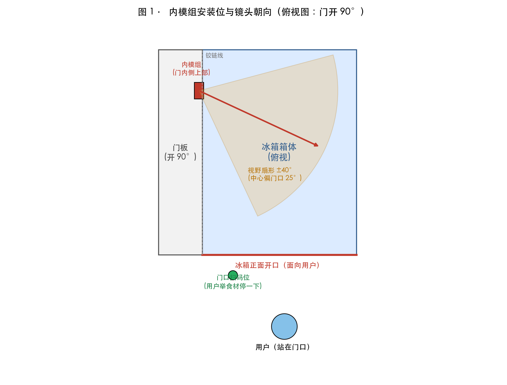
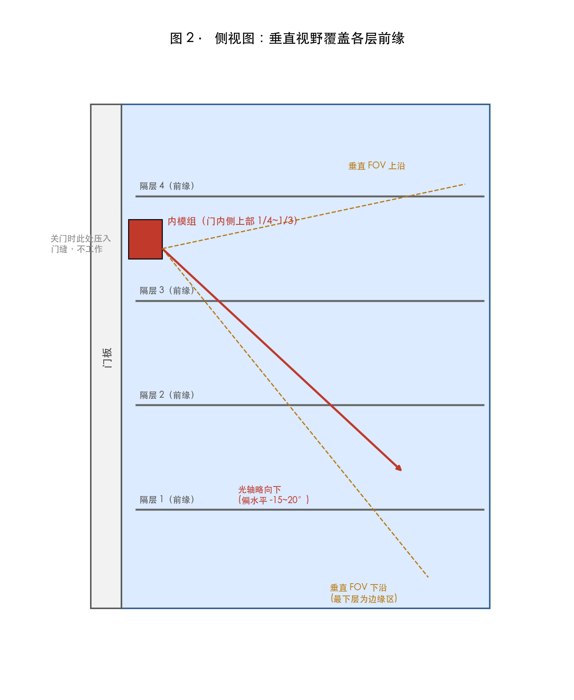

# 食刻 · HW-v1 硬件逻辑梳理文档（设计基线）

> 版本：v4.1 ｜ 重写：2026-08-20 ｜ 更新：2026-08-21（风险审查回填：本地 YOLO 时延目标修正为实测后定 ≤500ms；推送通道标注依赖 SW-v2）
> 定位：**硬件逻辑的单一事实源（SSOT）**。已定决策沉淀在本文档；新矛盾 → 登记 Issue；新决策 → 写 ADR；新假设 → 领实验卡。
> 关联：[硬件 User Stories](./硬件-用户故事.md)（需求基线）｜ [M1 执行清单](./EXP-M1-桌面验证-执行清单.md)（实验落地）
> 版本关系：T5-E1 = HW-v0 概念 demo（已完成）；双模组分体 = HW-v1 完整落地（开发中）——时间线关系而非竞争；对外展示理想场景，硬件与软件独立迭代。

---

## 0. 使用方式

1. **新矛盾 / 新漏洞** → §10 Issue 登记表加一行；
2. **需要拍板** → §9 写 ADR（决策、理由、代价、重审条件）；
3. **假设没数据** → §11 领实验卡，按"假设→实验→数据→决策"闭环；
4. **文档口径冲突** → 以本文档 + User Stories 为准，旧文档标注状态。

---

## 1. 产品形态

### 1.1 版本与迭代路线

| 轨道 | 版本 | 状态 | 内容 |
|---|---|---|---|
| 硬件 | HW-v0 | ✅ 已完成 | T5-E1 概念演示：扫描→识别→记账→显示 |
| 硬件 | HW-v1 | 🚧 开发中 | 双模组分体：外置平板 + 内摄像头，条码主路径 + 视觉兜底（本文档） |
| 硬件 | HW-v2 | 🔮 预留 | e-ink / 称重 / 门内温湿度 / OTA 商业化 |
| 软件 | SW-v0 | ✅ 已上线 | H5 + 大屏 + shike.live（扫描真实，其余演示数据） |
| 软件 | SW-v1 | 🚧 迭代中 | 接通全部接口（菜谱 / 成员 / 购物清单 / 营养 / 履历） |
| 软件 | SW-v2 | 🔮 预留 | 原生 App / 推送 / 家庭共享深化 |

### 1.2 双模组分体定义

| 模组 | 位置 | 职责 |
|---|---|---|
| 外置平板（磁吸冰箱贴） | 冰箱门外 | 触屏交互、库存展示、告警弹窗、确认兜底、云同步 |
| 内部摄像头模组 | 冰箱门内侧（可分离磁吸） | 条码解码 + 视觉识别、语音播报、经过事件检测、本地队列 |
| 出厂组合 | 两模组磁吸贴合 | 运输、配对、内模组充电、触点直连同步 |

### 1.3 安装位与视野





- **几何基准 = 开门 90°**：内模组视角由门开角决定（动态），关门时压入门缝不工作；
- **镜头朝向**：偏门口方向 20–30°（相对门板法线）——扫码主路径要求"用户在门口停一下即可扫"；
- **镜头规格（ADR-006）**：单镜头 + VCM 自动对焦（5–50cm 可变焦），准确率优先；不上双镜头；FOV 垂直 ≥60–70°、水平 ≥100°；
- **保鲜层高度参考（待 EXP-18 实测）**：两门 60–75cm / 对开门 75–95cm / 法式 65–85cm；层间距 15–25cm；内腔深 45–65cm；
- **安装位指南**：首次设置拍照校准 → 生成"可接受安装区"（门内侧上部 1/4~1/3，非精确坐标）→ 贴好后安装自检（判断视野是否含扫码位 + 上层搁架前缘，提示微调）；冰箱型号库为可选增强；
- **覆盖边界**：单摄像头只能看到各层前部深度（上层遮挡下层），最下层为 FOV 边缘区——不承诺精确到层，不设自动整体校正。

### 1.4 硬性约束

- 不新增称重传感器；不改造冰箱原有硬件 / 电路；
- 识别 = EAN-13 条码 + YOLO 视觉，无 RFID 标签依赖；
- 旧文档「条码扫码已决定不做」口径**已被取代**。

### 1.5 形态决策记录

候选：固定扫描台（A）/ 磁吸门版（B）/ 门内顶装（C）/ 手机（D）。加权初判 A=4.0、B=3.1、C=2.0、D=4.3——但双模组分体（外置平板 + 内模组）在"免手持 + 可交互 + 单摄像头约束"下收敛为 HW-v1 目标；B 的单板形态已被双模组分体取代，C 因多层不可俯视出局。

---

## 2. 识别体系

### 2.1 识别通道策略（ADR-009）

| 通道 | 触发 | 精度 | 用户操作 |
|---|---|---|---|
| 条码（EAN-13） | **主动扫码（主路径）**：拿起食材对准镜头，收银台式连续扫 | 精确（品名 + 保质期查库） | 每件扫一下，习惯化 |
| 视觉（YOLO） | 软兜底：未扫码直接放入时被动抓拍 | 品类级（牛奶 / 鸡蛋） | 零操作（不鼓励） |
| 双-check | 关门结算 | 事件交叉验证 + 人工兜底 | 汇总页一次确认 |

原则：条码是唯一精确通道，扫码即主路径；视觉兜底仅防漏，不喧宾夺主；**品类级保底 + 条码增强，非"条码必达"**。

### 2.2 本地优先架构（ADR-010 · 2026-08-20 实测定）

云端识别实测 >3s，识别主链路本地化：

```text
扫码瞬间 → 本地条码解码（ms 级）
         → 本地目录缓存命中？ → 是：<50ms 播报品名
                               → 否：云端查库（品名/保质期）→ 写入缓存
无码食材 → 本地 YOLO 品类（商用硬指标：≤500ms、mAP ≥85%）→ 播品类名
云端     → 仅查库 / 精修 / 双-check 比对
```

本地目录缓存决定"第二次扫同一件"是否也毫秒级播报（越用越快，家庭重复购买多）。

### 2.3 扫码决策树（有码 / 无码 / 失败）

条码检测 + YOLO 视觉并行运行：

| 系统判断 | 反馈 |
|---|---|
| 条码解码成功 | 播精确品名（查库） |
| 检测到条码但解码失败（模糊 / 角度 / 反光） | 播"请转一下条码"，转动即重试（<2s） |
| 未检测到条码候选（无码 / 条码被手遮） | 不走扫码流程，直接视觉识别 |
| 视觉置信度 ≥85% | 播品类名入账，不逐件确认（汇总页兜底） |
| 视觉置信度 <85% | 播"没看清，再试一次"，连续失败进汇总页待确认 |

### 2.4 无码与去包装食材

- 散装 / 切开 / 去包装：视觉品类级 + 品类默认保质期 + 可人工修正；
- 切开的肉：中途取出机制 + App 手动修正，不引入父子结构 / 剩余档位（粗颗粒度）；
- 相似物品：有条码 → 精确区分；无码 → 只承诺品类级，不承诺品牌区分；
- 误判无码（条码被手遮）= 精确度降级为品类级，可接受。

### 2.5 习惯养成设计

1. 动作顺手：拿起食材在门口"停一下"即完成扫码，融入放食材动作；
2. 连续扫模式（收银台式）：10 件约 15–20s，防重不打断（汇总页标"疑似重复"）；
3. 即时反馈：成功 = "叮 + 名称"；失败引导明确；
4. 开箱教育：把扫码绑定价值（精确保质期 = 少浪费）；
5. 软兜底：不扫直接放 → 视觉品类级 + 汇总标注，不惩罚但可见；
6. 验证：EXP-17 连续 7 天主动扫码率 ≥70%。

---

## 3. 交互与使用流程

### 3.1 模式A：主动录入（优先推荐）

```text
外置平板点【放入】→ 指令下发内模组 → 用户拿食材在门口扫码（条码本地解码 + 视觉兜底）
→ 语音播报「叮｜物品名称」→ 连续扫多个 → 关门 → 事件序列结算
→ 交叉验证：语音清单 vs 事件识别 → 有差异 → 汇总页待确认
```

### 3.2 模式B：被动兜底（经过事件检测）

```text
开门-放取-关门 → 内模组检测"经过事件"
→ 物体进入视野（放入）或离开视野（取出）瞬间抓拍识别（未被遮挡时）
→ 记录"放入/取出候选 + 画面高度层位" → 关门汇总 → 与模式A 交叉验证
→ 边界：每层仅前部深度可见；放入后部/被上层遮挡的物体靠事件识别，无法事后验证
```

识别时机前移 = 遮挡发生在放上搁架之后，不影响识别。

### 3.3 事件序列与取出闭环（含中途取出）

1. 门开期间所有经过事件入队：时间戳 + 方向候选 + 抓拍帧 + 外观特征；
2. 关门结算：按时间排序 → 方向判定（进入 = 放入候选，离开 = 取出候选）；
3. **中途取出（2026-08-20 定）**：同一开门窗口内，取出后出现**身份一致**（同条码，或视觉高匹配且均无码）的放入 → 库存净 0、不分别记账，放回播报"叮｜牛奶（中途取出）"；身份不一致（放新取旧）→ 分别记取出 / 放入；
4. 取出清单：未配对的取出候选 → 高置信静默出库，低置信弹窗"取出了什么？"；
5. 部分消耗（取出切用后放回）：粗颗粒度接受，库存不变，用户听到提醒后 App 手动修正；
6. 汇总：放入 X / 取出 Y / 中途取出 Z / 未识别 W → 一次确认提交云端。

### 3.4 关门结算与汇总页（三通道呈现）

1. **三通道**：外置平板（关门后若用户在旁则亮起）+ 待确认状态（下次查看任何端可见）+ 推送（仅差异显著，如未识别 ≥3 件；**推送通道依赖 SW-v2 原生 App / 小程序，样机阶段先做前两通道**）；
2. **触发分级**：全部高置信一致 → 静默入账；有可疑项 → 待确认 + 可选推送；异常显著 → 强调提醒；
3. **布局**：顶部"放入 X / 取出 Y / 中途取出 Z / 未识别 W"；可疑项展开可操作；高置信项默认折叠；
4. **确认**：一键全部确认（可疑项高亮）或逐条细看。

### 3.5 语音反馈与静音

- 播报分级：条码 = 精确品名；视觉 = 品类名；断网 = 本地目录名；静音 = 屏幕显示 + 短促提示音 / 振动；
- 静音模式：夜间时段（App 设置）+ 快速按键静音，识别结果仍在屏幕与汇总页可见；
- 防重：扫码节奏不打断，汇总页标"疑似重复"。

---

## 4. 网络与同步

### 4.1 拓扑（ADR-008）

- 内模组**独立 Wi-Fi**（ESP32-S3 集成，零额外成本）；
- 数据同步依赖**开门窗口**（门开时信号穿透）+ **关门短窗口补传**（EXP-01 初步实测关门有网，2026-08-20）；
- 不做穿门实时通信；平板中继仅作内模组 Wi-Fi 故障时的降级路径；
- 离线队列保留为**弱网兜底**（I-14：本地存事件 + 缩略图，按时间序上传，云端幂等去重）。

### 4.2 确认时效（ADR-005）

延迟确认：汇总进入待确认状态，下次查看可见 + 严重差异推送；不追求关门即时（关门断网是物理现实）。

### 4.3 多端一致性

云端权威：内模组 / 外置平板 / H5 都从云端读写；离线事件按时间戳合并；补传按幂等键去重。

---

## 5. 供电与充电

### 5.1 外置平板（ADR-003）

- LCD + **PIR 接近唤醒**（30s 自动熄屏）+ 亮度自适应 + 触摸续亮；
- 电池 **2000mAh**，目标 **3–4 个月**（日均 ≤20mAh，优化后 ≤12mAh）；
- Wi-Fi 按需同步（显示 / 打开 App 时），不常连；
- 触屏防水 / 防误触（I-27 / US-86）。

### 5.2 内模组（磁吸回平板充电）

- 电池 **1000mAh**，目标 **3–4 周**（事件驱动工作：检测到物体才抓拍识别，35–50mAh/天）；
- 充电：取下贴回平板组合位，磁吸对齐 + **pogo pin 触点**（非 Qi），1 小时充 80%；USB-C 直充备用；
- 平板反向供电：电量 <50% 停止（保护平板）；低电量 <20% 提前预警（内模组离线 = 扫码不可用）；
- 充电期间 App 提示"内模组充电中"，建议晚间充电；组合位充电顺带触点直连同步。

### 5.3 低温充电安全

充电管理 + NTC 温度检测：<0°C 或 >45°C 禁止充电，提示"移出冰箱回温后再充"；取下充电自然回温。

---

## 6. 环境与可靠性（待实测）

| 项 | 方案 | 验证 |
|---|---|---|
| 凝露 / 防雾 | 镜头窗防雾镀膜 + 壳体密封，必要时加干燥剂 / 透气膜 | EXP-03（24h 低温后取出 30s 可识别） |
| 门信号衰减 | 架构已按最坏情况兜底；初步实测关门有网 | EXP-01 补多台冰箱数据 |
| 磁吸脱落 / 振动 | N52×4 + 硅胶垫 | 100 次关门 0 脱落（G7） |
| 低温连续工作 | 2–8°C 24h 正常 | G5 同批 |

---

## 7. 隐私与安全

1. 事件驱动录制（开门 / 关门 / 补拍）+ 录制指示灯 + 物理镜头盖（US-84）；
2. 抓拍图上传云端做识别是必需的，识别完成后**立即清理或仅存缩略图**，不长期留存原始图（可配置）；
3. 数据按家庭隔离，影像默认私有，仅家庭成员可见（US-68）。

---

## 8. 软件配套与库存差异修正

- **分层模型**：画面高度 ↔ 层位，仅作事件归属参考；第一版不承诺精确到层，不配置也可用（库存按容器 / 品类粒度）；
- **库存管理**：容器 / 保质期 / 临期提醒（SW-v0 已实现，SW-v1 接通接口）；
- **库存差异处理（已定：不设盘点）**：汇总页 / 库存页暴露"可疑项"（未识别、清单 vs 事件不一致、低置信出库）→ 用户在 App 补加 / 删除 / 编辑（复用快速录入，后端补 manual 写入接口）；
- **开箱设置**：配对 + 拍照校准 + 安装自检，≤5 分钟（US-85）。

---

## 9. 决策记录（ADR 汇总）

| ID | 主题 | 状态 |
|---|---|---|
| ADR-001 | HW-v1 落地范围与里程碑排序 | ⏳ 待数据（EXP-01/16 后签发） |
| ADR-002 | 关门汇总确认位置 | ✅ 已解决：三通道呈现（3.4） |
| ADR-003 | 外置平板屏幕与续航（PIR 唤醒 + 2000mAh，3–4 个月） | ✅ 已接受 |
| ADR-004 | 方向判定方案（全自动 / 半自动 / 人工兜底） | ⏳ 待数据（EXP-16） |
| ADR-005 | 确认时效（延迟确认：待确认 + 下次查看 + 严重推送） | ✅ 已接受 |
| ADR-006 | 镜头（单镜头 + VCM 自动对焦，准确率优先） | ✅ 已接受 |
| ADR-007 | 基准帧策略 | ❌ 已废弃（机制被事件检测取代） |
| ADR-008 | 通信拓扑（独立 Wi-Fi + 开门窗口同步，无穿门实时通信） | ✅ 已接受 |
| ADR-009 | 识别策略（主动扫码主路径 + 视觉软兜底 + 习惯养成） | ✅ 已接受 |
| ADR-010 | 识别架构（本地优先：条码 ms + 本地 YOLO **≤500ms、mAP ≥85% 商用硬指标**；云端辅助；不达标升级视觉协处理器，**不降功能**） | ✅ 已接受（2026-08-21 修订） |

---

## 10. Issue 登记表（按状态）

### 10.1 已决策 / 已解决

| ID | 主题 | 依据 |
|---|---|---|
| I-01 | 版本口径（v0 demo / v1 目标，时间线关系） | 本文档 §1.1 |
| I-02 | 外置平板功耗 | ADR-003 |
| I-03 | 关门汇总不可见 | 三通道呈现（3.4） |
| I-04 | 云端时延 >3s | ADR-010（本地识别为主） |
| I-05 | 交互口径（触屏 / 按键） | 双模组形态下已定 |
| I-07 | 位置感知（内 / 外门） | 双模组分工固定，消解 |
| I-08 | 补传时机 | 开门窗口 + 重试 + 幂等（4.1） |
| I-09 | 库存纠错闭环 | App 手动修正（8） |
| I-10 | 门衰减假设 | EXP-01 初步：关门有网 → 短窗口补传（仍待多台数据） |
| I-13 | 穿门通信 | ADR-008（不做穿门实时通信） |
| I-18 | 确认时效 | ADR-005（延迟确认） |
| I-20 | 镜头规格 | ADR-006（VCM） |
| I-21 | 模式B 机制（区域差值 → 事件检测） | 3.2 |
| I-23 | 内模组充电 | 磁吸回平板（5.2） |
| I-26 | 分层定位降级 | 8（不承诺精确到层） |

### 10.2 待设计 / 待实测

| ID | 主题 | 优先级 | 状态 |
|---|---|---|---|
| I-06 | 方向判定（进入 / 离开视野） | P0 | 待设计，并入 EXP-16 |
| I-11 | 凝露 / 防雾方案 | P0 | 待 EXP-03 |
| I-12 | 锂电低温充电安全 | P1 | 方案已定（5.3），待实现 |
| I-14 | 离线队列实现（存事件 + 缩略图 + 幂等） | P0 | 方案已定（4.1），待实现 |
| I-15 | 被动模式遮挡上限（首放即遮） | P1 | 接受上限，汇总页兜底 |
| I-16 | 视觉同物追踪（切开 / 形变） | P1 | 中途取出 + App 手动修正 |
| I-19 | 镜头朝向 / 安装角度 | P0 | 待 EXP-12 / EXP-18 |
| I-22 | 取出闭环 | P0 | 方案已定（3.3），待 EXP-14/16 |
| I-24 | 语音断网降级 | P1 | 本地目录名兜底，待实现 |
| I-25 | 隐私录制策略 | P1 | 方案已定（7），待实现 |
| I-27 | 外置平板湿手触屏 | P1 | 待 EXP-15 |
| I-28 | 混合序列（中途取出后放入） | P0 | 方案已定（3.3），待 EXP-16 |

---

## 11. 实验计划

### 11.1 EXP 状态表

| ID | 实验 | 状态 |
|---|---|---|
| EXP-01 | 门衰减 | ✅ 已实测（初步：关门有网）→ 补多台数据 |
| EXP-02 | 开门节奏 | 🔄 进行中（单件 2–3s） |
| EXP-03 | 凝露 / 防雾 | 待执行 |
| EXP-04 | 方向判定 | ⏸ 延后，并入 EXP-16 |
| EXP-05 | 云端时延 | ✅ 已实测（初步：>3s → ADR-010）→ 补完整统计 |
| EXP-06 | 双模组功耗 | 待执行（样机） |
| EXP-07 | 条码识别精度（≥97%） | 待执行 · 最高优先 |
| EXP-08 | 开门窗口同步成功率 | 待执行 · 最高优先 |
| EXP-09 | 断网压测（0 丢失） | 待执行 |
| EXP-10 | 双-check 一致性 | 待执行 |
| EXP-11 | YOLO 冰箱内基准（板端量化） | 待立项 · **优先级提升（ADR-010）** |
| EXP-12 | 扫码动作几何（可读率 ≥90%） | 待执行 · 最高优先 |
| EXP-13 | 确认时效 | 验证性 |
| EXP-14 | 取出事件识别 | 待执行 |
| EXP-15 | 湿手触控 | 待执行 |
| EXP-16 | 混合序列 / 中途取出 | 待执行 |
| EXP-17 | 7 天扫码习惯留存（≥70%） | 待执行 · 产品决策关键 |
| EXP-18 | 冰箱尺寸 / 视野覆盖 | 待执行 · 与 EXP-12 同级 |
| EXP-19 | 安装指南可用性 | 待执行 |

### 11.2 里程碑执行顺序

| 里程碑 | 实验 | 目的 | 依赖 |
|---|---|---|---|
| M1 桌面验证（进行中） | EXP-01 / 02 / 05 / 18 | 架构参数 | 手机 / 量尺 / 现有后端 |
| M2 工程样机验证 | EXP-07 / 08 / 12 / 15 | 扫码主路径 + 单摄像头方案 | 样机 A |
| M3 家庭实测 | EXP-16 / 17 / 19 / 14 | 习惯留存 + 事件结算 | 样机 B + 用户 |
| M4 环境与功耗 | EXP-03 / 06 / 09 | 可靠性 + 续航 | 样机 B + 冰箱 |
| 并行 | EXP-11（YOLO 数据集） | 视觉能力 | 数据采集 |

---

## 12. 验收门禁

| 门禁 | 通过标准 | 证据 |
|---|---|---|
| G1 落地范围 | ADR-001 已签发 | 决策记录 |
| G2 续航 | 外置平板 ≥3 个月；内模组 ≥3 周（实测） | EXP-06 |
| G3 识别时延 | 本地条码 <100ms；目录命中 <50ms；云端查库 P95 <2s | EXP-05/07 |
| G4 准确性 | 方向 ≥95%；漏检 ≤2%；空手误触发 ≤5% | EXP-16 |
| G5 凝露 | 24h 低温后取出 30s 内可识别 | EXP-03 |
| G6 数据可靠 | 断网 100 次 0 丢失；补传不重复 | EXP-09 |
| G7 结构 | 100 次关门 0 脱落 | 实测 |
| G8 安全 | 低温充电保护生效 | 测试 |
| G9 条码 | EAN-13 识别率 ≥97% | EXP-07 |
| G10 同步可靠 | 开门窗口同步成功率 ≥99% 或 0 丢失 | EXP-08/09 |
| G11 双-check | 差异率 ≤10%，单次购物弹窗 ≤2 次 | EXP-10 |
| G12 扫码动作 | 真实动作条码可读率 ≥90% | EXP-12 |
| G13 确认时效 | 延迟确认用户可接受 | EXP-13 |
| G14 事件闭环 | 中途取出误判 ≤5%（不同条码不误判） | EXP-16 |

---

## 13. 当前状态与下一步

**已收敛**：形态、识别、交互、网络、供电、隐私全部定案；ADR-001~010 有归宿。

**进行中**：M1 桌面验证（EXP-01 有初步结果、EXP-02 记录中、EXP-05 已触发 ADR-010）。

**本周建议**：

1. EXP-01 补 2–3 台冰箱数据（确认"关门有网"是否普遍）；
2. EXP-05 补完整 50 次统计（P95 + 图片特征分组），定本地目录缓存阈值；
3. **EXP-11 立项**（板端 YOLO 量化是 ADR-010 的关键路径，尽早采集冰箱内数据集）；
4. EXP-18 找 5 种冰箱测视野，定 FOV / 安装位；
5. 数据齐后签发 ADR-001（落地范围与里程碑）。
