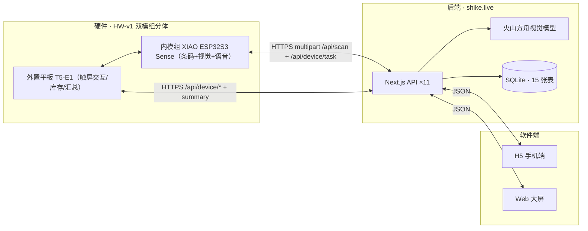

# 「食刻」项目全面评估与商业化分析报告

> 版本：v2.0 ｜ 评估日期：2026-08-17 初版，2026-08-23 按最新资料整体重写
> 评估对象：AI 硬件初创项目「食刻」（Slogan：食刻在场，不浪费每一份食材），**HW-v1 双模组分体形态**
> 评估方法：项目文档审计 + 线上系统实测验证 + 公开市场数据调研 + 竞品分析
> 适用范围：团队决策、融资/众筹准备、投资人尽调参考

> **v2.0 口径说明（2026-08-23）**：本版基于最新项目资料整体重写——**HW-v1 双模组分体**（外置平板 T5-E1 + 内模组 XIAO ESP32S3 Sense），识别链路**本地优先**（EAN-13 条码本地解码 ms 级 + 本地 YOLO 品类 + 云端查库，ADR-010），交互为**条码优先主动扫码 + 语音播报 + 关门结算延迟确认**；样机核心件已采购（BOM v4.0，实付约 ¥177）、内模组固件 4 示例编译通过、外置平板 v1 门外交互已实施、后端契约 v3 已实现。文中「3 秒倒计时 / 识别 3–5 秒 / 单板扫描台」等均为 HW-v0 历史口径。团队人数按团队确认口径为 **4 人**。最新硬件逻辑以 [设计基线 v4.1](../02-硬件/设计基线-硬件逻辑梳理.md) 为准。

---

## 摘要（一页版）

**食刻是什么**：一台贴在冰箱门上的 AI 食品扫描系统，**双模组分体**——门外是外置平板（触屏交互 / 库存 / 汇总确认），门内是摄像头模组（EAN-13 条码本地解码 + 视觉兜底 + 语音播报）。把食品拿到镜头前扫一下（或经过镜头），条码毫秒级本地解码、无码走视觉兜底，云端查库补全品名与保质期，库存自动 ±1；关门结算一次确认。外置平板待机常显临期/过期提醒，手机 H5 端和大屏端随时查看库存、菜谱、购物清单。核心链路「扫 → 认 → 记 → 显」已端到端跑通：后端已上线 `shike.live`、内模组固件示例全部编译通过、外置平板 v1 已实施、3D 打印外壳完成、HW-v1 样机核心件已采购待组装联调。

**完成度评估（总分 7.9/10）**：

| 维度 | 评分 | 一句话判断 |
|---|---|---|
| 硬件/固件 | 7.5/10 | HW-v1 双模组设计定案、样机核心件已采购、内模组 4 示例编译通过；**整机未组装联调** |
| 后端/云端 | 8.5/10 | 11+ 接口、15 张表上线，契约 v3（含 task / scan-latest / summary）已实现 |
| 视觉识别 | 6/10 | 本地条码解码已实现；日期提取/识别准确率仍是最大短板，本地 YOLO 未落地 |
| 软件端 | 8/10 | 外置平板 v1 门外交互已实施编译通过；H5/大屏完成度高，部分页面仍为演示数据 |
| 产品叙事 | 8.5/10 | 故事完整、演示剧本清晰，情绪闭环设计到位 |
| 商业化准备度 | 5/10 | BOM/预算/出海文档完整并已启动采购；但尚无定价测试、收入与用户验证 |

**商业化核心判断**：

1. **市场真实但拥挤**：中国每年浪费食物超 1 亿吨、家庭冰箱保有量超 3 亿台，"食材管理"确为高频痛点；但海尔/美的/三星的 AI 冰箱已把"食材识别+过期预警"内置为标配功能，免费 App（摆烂冰箱、NoWaste 等）也已完成市场教育。食刻必须靠"对存量电器进行智能化+AI改造+零学习成本+家庭共享"这一楔子切入，而非与巨头正面竞争。
2. **当前最大风险不是市场而是产品**：实测线上数据里，多件真实扫描记录的到期日为空、状态 unknown，出现"抽纸被扫进冰箱""图片倒置日期无法辨识"等失败案例。识别与日期提取的准确率不解决，任何商业化都是空谈。
3. **建议的商业模式**：C 端"硬件+增值订阅"与 B 端"餐饮/食堂/药房合规盘点 SaaS"双线，以 B 端轻资产先行验证付费意愿；同时保留"向家电厂商标识技术授权"的退出通道。
4. **下一步（30 天）**：先做 100 人真实用户测试把识别率从当前水平提到 ≥90%，再决定众筹（C 端）或样板客户（B 端）路线；不建议在没有准确率数据前启动任何付费销售。

---

# 第一部分　项目全面评估

## 1.1 项目概览

| 项 | 内容 |
|---|---|
| 项目名 | 食刻（英文代号 Shike） |
| 定位 | 冰箱食品保质期管理扫描系统（本地条码优先 + AI 视觉兜底 + 家庭库存） |
| 形态 | **HW-v1 双模组分体**：外置平板（门外交互）+ 内模组（门内扫码/语音） |
| 阶段 | HW-v1 样机组装联调期：核心件已采购、固件示例编译通过、后端全链路上线 |
| 核心链路 | 扫（主动扫码/条码本地解码）→ 认（本地条码 + 视觉兜底 + 云端查库）→ 记（库存 ±1 + 关门结算）→ 显（平板 + H5/大屏） |
| 当前状态 | BOM v4.0 核心件已采购（实付约 ¥177，待收货）；内模组 4 示例编译通过；外置平板 v1 已实施；后端 shike.live 契约 v3 已实现 |
| 一句话价值 | 把"放进冰箱就忘了"变成"谁快过期、能做什么菜"随时可见 |

## 1.2 演进历程：一次关键方案收敛

项目经历了一次**关键方案收敛**，这一过程本身值得记录：

- **8/12 前**：早期构思为面向独自出行的中老年女性的"随身出行陪伴"方案（挂脖摄像头设备 + 云端视觉 AI 实时分析 + 语音引导，链路"看→想→说"）。方案完整但硬件依赖 ESP32-CAM（全赛仅 10 个）、OLED、锂电池等稀缺物料，且视频实时分析延迟 2.5–5 秒、断网依赖离线状态机，演示风险高。
- **8/14 晚**：决定收敛为「食刻」——T5-E1 单板（屏/触控/摄像头/音频全板载）+ 固定 USB 供电 + 拍照识别保质期。物料依赖大幅降低，主链路只剩"一块板 + 一个后端"。
- **8/16 12:00**：主链路全部实现并上线，按"最小 MVP 与 Pitch 双主线执行方案"完成交付。
- **8/20–8/21**：**HW-v1 双模组分体定案**——门外外置平板（触屏交互/库存/汇总确认）+ 门内摄像头模组（条码优先 + 视觉兜底 + 语音播报）；ADR-010 实测确认云端识别 >3s，识别主链路本地化（本地条码 ms 级 + 本地 YOLO ≤500ms + 云端仅查库/精修）。摄像头降级目标 OV2640 → OV3660（OV2640 已停产）。
- **8/21–8/23**：BOM v4.0 定稿并完成核心件采购（A1 Sense ¥113.85、A2 Grove Shield ¥38.85、A3 MAX98357A+喇叭 ¥13.3、A5 光敏 ¥2.76、A7 按键 ¥4.33、A9 面包板 ¥4.17，实付约 ¥177）；Arduino 环境就绪（esp32 2.0.14 + ZXing + C++17），内模组 4 示例编译通过；外置平板 v1 门外交互（待机/放入/取出/汇总）实施并编译通过；后端 task / scan-latest / summary 契约 v3 实现。

**评估**：这次收敛是产品定义上最正确的一步。食刻把不确定性从"稀缺物料 + 复杂端云视频链路"压缩到"单板拍照 + 一个 HTTP 接口"，在极短周期内交付了可连续演示的真实闭环；HW-v1 再进一步收敛为"条码本地解码 + 关门结算"，把识别延迟从 3–5 秒压到毫秒级，并把"记录动作"升级为"主动扫码习惯 + 被动事件兜底"双通道。早期方案沉淀的"双端、隐私、断网降级、状态机"设计思路，仍可作为食刻未来做"家庭关怀/银发场景"时的参考。

## 1.3 交付物盘点（逐项核验）

| 类别 | 交付物 | 状态 | 备注 |
|---|---|---|---|
| 硬件（外置平板） | T5-E1（SPARKLEIOT T5AI DEV）：ST7789 触控屏 + CST816X + GC2145 + 音频 | ✅ 已到手，v1 固件编译通过 | 门外交互 / 库存 / 汇总确认；GC2145 仅安装自检 |
| 硬件（内模组） | Seeed XIAO ESP32S3 Sense（OV3660 摄像头 + PDM 麦克风 + microSD）+ Grove Shield + MAX98357A + 光敏/按键/KY009 | 🚧 核心件已采购（BOM v4.0，实付约 ¥177），**待收货组装** | 门内扫码 / 语音播报 / 事件检测 |
| 固件（内模组） | Arduino：esp32 2.0.14 + esp32-camera + ZXing（C++17），D2/02/03/04/05 五个示例 | ✅ 4 示例编译通过（2026-08-23） | 拍照上云、语音播报、事件检测、条码本地解码、完整链路 |
| 固件（外置平板） | TuyaOpen `app_xzd.c` v1：待机/放入/取出/结果/汇总状态机 + net 函数 | ✅ 已实施，编译验证通过（2026-08-23） | 汇总页接真实 summary pending/confirm |
| 后端 | shike.live：Next.js + Prisma + SQLite，Docker 部署 | ✅ 线上验证（HTTP 200） | 11+ 个 API、15 张表；契约 v3：task / scan-latest / summary 已实现 |
| 视觉 AI | 云端火山方舟 doubao-seed-2-1-turbo-260628（查库/精修）＋ 本地条码 ZXing | ✅ 云端已接入；本地条码已实现 | 本地条码 ms 级；本地 YOLO 为 D8 待办（未落地） |
| 软件 | H5 手机端 / 大屏 Web / 硬件交互 Demo | ✅ 可用 | 扫描页真实接口，部分页面演示数据 |
| 结构 | 3D 打印外壳（小房子造型，米白机身 + 红屋顶 + 磁吸后盖）+ 双模组安装位 | ✅ 模型完成 | 参数化建模，可重新生成 |
| 硬件库 | HW-001~013 器件库 + 总清单 + 实拍图 | ✅ 已建 | 复用库件：杜邦线 / 电阻 / KY009 / T5 板 |
| 文档 | 设计基线 v4.1 / 成品规格书 / 选型 / BOM / 烧录 / 测试 / 对接 / 执行 / 风险 | ✅ 完整 | 文档纪律优秀，交接与复现性良好 |
| 仓库 | github.com/wenlinl/shike（公开） | ✅ 存在 | 0 star，代码已分工程目录整理（firmware/hardware/docs/web-demos） |

## 1.4 技术评估

### 1.4.1 架构评估



**优点**：

- **本地优先主链路（ADR-010）**：条码本地解码 ms 级、云端仅查库/精修，规避云端 3–5 秒延迟；断网时本地条码 + 离线队列可继续工作。
- **双模组分体**：门外平板负责交互/展示，门内模组负责感知/扫码，形态与成品架构一致（可量产迁移），比单板更符合真实使用习惯。
- **关门结算 + 确认制**：连续扫码无需逐件确认，差异进汇总页一次确认，兼顾速度与准确。
- **数据模型前瞻**：15 张表覆盖库存、流水、成员、容器、知识库、菜谱、通知、消耗统计、设备心跳，超出原型所需，为商业化预留了结构。
- **视觉识别可替换**：AI 层走火山方舟 API，未来可切模型/自训练，不绑定单一供应商。

**不足**：

- **无鉴权**：`/api/scan`、`/api/device/*` 原型阶段公开（后端已设计 X-Device-Token 头与 Device.tokenHash，固件侧未全面落地），商业化前必须补齐。
- **固件 TLS no-verify**：原型可接受，量产前必须证书校验。
- **SQLite 单文件**：作为 Demo 足够，但多设备/多家庭并发后需迁移 PostgreSQL。
- **本地 YOLO 未落地**：无码食材的品类兜底（≤500ms）依赖 D8 板端 YOLO 示例，当前尚未覆盖该场景。
- **整机未联调**：样机核心件待收货，双模组"扫码 → 云端 → 平板 → 关门结算"尚未端到端跑通。
- **单点部署**：服务器、域名、火山方舟 Key 全部复用个人项目（midyear-workshop），商业化时域名归属、密钥管理、部署运维都是隐患。
- **数据质量缺治理**：识别知识库（FoodCatalog）自动沉淀但无人工审核闭环，错误品类会持续污染后续识别。

### 1.4.2 完成度评分表

| 模块 | 完成度 | 证据 | 商业化差距 |
|---|---|---|---|
| 内模组固件 | 85% | 5 示例就绪、4 编译通过（拍照/语音/事件/条码/链路） | 整机联调、设备注册/鉴权/OTA |
| 外置平板固件 | 75% | v1 状态机（待机/放入/取出/结果/汇总）编译通过 | 低功耗待机、推送通道（依赖 SW-v2） |
| 后端 API | 85% | 11+ 接口线上可用，契约 v3（task/scan-latest/summary）已实现 | 无计费、部分页面仍演示数据 |
| 视觉识别 | 60% | 本地条码已实现；云端日期提取失败率高（见 1.4.3） | 日期提取、防误扫、本地 YOLO |
| H5/大屏 | 75% | 页面全、扫描真实 | 首页/库存/菜谱/我的多为演示数据 |
| 定时推送 | 30% | 表已建、接口未做 | 临期推送是留存核心，必须做 |
| 多用户/家庭 | 40% | Member/Container 表已建、注册登录已上线 | 权限、家庭绑定深化 |
| 供应链/量产 | 20% | 3D 打印外壳 + 双模组模块化拼装 | 无模具、无认证（PSE/TELEC/FCC） |

### 1.4.3 真实运行数据审计（关键发现）

2026-08-17 对线上 `GET /api/items` 与 `GET /api/reminders` 实测，发现以下模式：

1. **日期提取成功率低**：多件真实扫描记录 `expiryDate` 为 null、`daysLeft` 为 -1、状态 unknown。典型备注："未读取到生产日期""图片倒置，日期无法辨识""画面模糊倒置，仅能识别为瓶装饮用水"。
2. **非食品误入库**：`洁柔 Face 抽纸`（纸巾）出现在冰箱库存与临期提醒里——视觉模型未做"是否食品"的拦截。
3. **识别对象跑偏**：出现 `Tims 杯装饮品`、`Tim Hortons 奶茶`、`生椰拿铁` 等一批同一来源饮品被拆成 5–6 条近似记录，说明同物多名、去重/归一化缺失。
4. **数量记录不可靠**：`农夫山泉饮用水` quantity=9（一箱被计为 9 件），后续取出逻辑会很难对齐。

**结论**：这条线上数据是本次评估最有价值的证据——它证明"识别出这是什么"和"读出准确保质期"是两件难度完全不同的事，后者正是食刻商业价值的核心，也是当前最薄弱环节。任何商业化方案必须先把这一指标做出来、可度量、可迭代。

> **v2.0 补充（2026-08-23）**：以上数据采集于 HW-v0 云端识别阶段（2026-08-17）。HW-v1 已把主链路改为**本地条码解码优先**（条码精确对应品名 + 保质期，天然规避"读错日期"），并将"读不出就不猜"（低置信不入库）固化为产品规则——但该方案能否把真实场景的"日期/品名准确率"拉到 ≥90%，**必须等样机整机联调后用新数据验证**，本审计的结论依然成立。

### 1.4.4 工程与代码质量

- **文档纪律极好**：从物料策略、烧录 SOP、API 契约到演示话术全部成文，交接成本低，这在早期创业团队中罕见。
- **降级设计成熟**："实时硬件 Demo → 预置图片驱动真 AI → 本地录屏"三级降级、18:00 演示闸门、代码冻结时间点，是标准的专业交付流程。
- **代码复现性**：固件源码在 GitHub（C 语言），但仓库无 README、无描述；后端源码未在本目录，依赖个人机器上的 midyear-workshop 工程，存在丢失风险。建议立即将完整工程（含后端）纳入版本管理。

### 1.4.5 安全与合规现状

| 项目 | 现状 | 商业化要求 |
|---|---|---|
| 接口鉴权 | ⚠️ 后端已设计 X-Device-Token + 用户登录，固件侧未全面落地 | 设备 Token + 用户登录全链路启用 |
| 传输安全 | ⚠️ 固件 TLS no-verify | 证书校验 |
| 隐私（摄像头） | ⚠️ 扫码时拍照（本地条码优先，非全程录像） | 需隐私政策、明示同意（PIPL） |
| 无线认证 | ❌ 未涉及 | 量产需 SRRC/CCC 等 |
| 数据归属 | ⚠️ 域名/服务器个人所有 | 需公司主体与正式域名 |

## 1.5 产品与体验评估

**做得好的**：

- 交互贴合习惯：外置平板触屏【放入】【取出】→ 云端下发 → 门内"停一下即扫"，条码本地毫秒级解码 + "叮 + 名称"语音播报；连续扫无需逐件确认，关门结算一次确认。
- 反馈闭环完整：扫码 → 语音播报 → 平板显示品名/保质期/建议容器 → 关门汇总确认 → 库存变化可见。
- 主动扫码 + 被动兜底双通道：扫码是主路径（精确），事件检测兜底防漏（品类级），"读不出就不猜"。
- 从"记录工具"升维到"家庭管家"：菜谱推荐（有/缺食材）、购物清单、家庭共享、营养档案在 H5 里有完整的产品逻辑，虽然数据多为演示，但产品思考已经完整。
- 叙事有情绪：Slogan"食刻在场，不浪费每一份食材"、演示收尾停顿两秒、过期贴纸彩蛋——这些都远超普通原型 Demo 的表达水准。

**待解决的体验问题**：

- 扫码主路径依赖"主动把条码对准镜头"的习惯养成（设计基线 EXP-17 目标：连续 7 天主动扫码率 ≥70%），未养成前会有漏扫。
- 待机屏只有临期提醒，没有"今天吃什么/还缺什么"的主动内容，屏幕利用率低。
- 取出流程要求"把食品再扫一遍"，与真实习惯（一次拿多件、或食品已被丢弃）不符，长期留存需要"批量操作/按名字勾选取出"（设计上已列入）。
- 断网降级已设计（本地条码 + 离线队列补传、平板显示本地最近库存），但需整机联调验证。

## 1.6 团队与执行过程评估

从文档可以还原出一个执行力很强的 4 人团队（团队确认口径）：

- 明确分工（视觉链路/云 AI/触控+大屏/Pitch/Demo 导演），每角色有"完成定义与禁区"。
- 明确取舍（"不做多容器实体传感器布点、不做连续视频监控、不做电商下单"），用 Roadmap 兜住非核心功能。
- 明确时间闸门（18:00 主链连续成功 3 次、8/16 10:00 代码冻结）。

**团队画像推断**：具备硬件开发（TuyaOpen/烧录）、后端（Next.js/Prisma/Docker）、前端（H5 高完成度）、产品叙事四类能力，覆盖了硬件创业的最小能力集。商业化阶段最缺的是：渠道/销售、供应链管理、财务与法务。

## 1.7 综合评估结论

### 优势清单

1. 真实可演示的端到端闭环（硬件 → 云 → 软件），不是 PPT 产品。
2. HW-v1 双模组分体与成品架构一致，本地条码主链路已实现，量产迁移路径清晰；样机核心件已采购（实付约 ¥177），成本可控。
3. 数据模型与软件产品逻辑超前于 Demo 阶段，扩展性好。
4. 文档与执行纪律优秀，团队可复现、可交接。
5. 主题踩中"反食品浪费 + AI 硬件 + 女性家庭关怀"三重叙事红利。

### 短板清单

1. 识别/日期提取准确率是致命的商业化短板（有真实数据为证）。
2. 整机未联调：样机核心件待收货，双模组全链路（扫码 → 云端 → 平板 → 结算）尚未端到端跑通。
3. 本地 YOLO 品类兜底未落地（D8 待办），无码食材场景覆盖不足。
4. 无支付与定价测试，商业模式尚未被市场验证。
5. 与海尔/美的/三星内置 AI 冰箱存在正面替代关系，差异化叙事尚未验证。
6. 资产归属模糊（域名/服务器/代码分属个人），无公司主体。

---

# 第二部分　商业化分析

## 2.1 市场分析

### 2.1.1 需求底层：食物浪费是真实且巨大的社会问题

- 2024 年中国被列为全球食物浪费第一大国，全年丢弃食物超 **1.08 亿吨**，人均约 76 公斤/年（《世界人口评论》汇编数据）。
- 中国科学院调查显示，仅餐饮环节年浪费约 1700–1800 万吨，相当于 3000–5000 万人一年的口粮。
- 家庭端浪费的核心机制正是"看不见"：东西放进冰箱即脱离视线，过期后才发现。"保鲜时长、过期预警、健康饮食建议"被行业机构列为消费者对冰箱的三大核心需求。

> 结论：食刻解决的是"家庭食品库存可见性"问题。需求真实、有社会政策红利（反食品浪费法背景）、有情绪传播力（环保 + 省钱 + 亲情）。

### 2.1.2 市场规模测算（TAM / SAM / SOM）

| 层级 | 口径 | 测算 | 依据 |
|---|---|---|---|
| TAM | 中国家庭食材管理市场 | 约 **200–400 亿元/年** | 城镇冰箱保有量 3.24 亿台 × 家庭食材管理类产品/服务年均支出 60–120 元 |
| SAM | 可触达的智能硬件+订阅细分 | 约 **20–40 亿元/年** | 智能冰箱国内市场规模 2025 年约 21.6–23.5 亿元；按"存量冰箱外挂智能配件"新增市场估算 |
| SOM | 食刻 3 年内现实可达 | 约 **0.3–1 亿元/年** | 年销 5–20 万台 × 客单价 250–350 元（含订阅），见 2.7 财务模型 |

补充锚点数据：

- 中国城镇冰箱每百户拥有量约 104 台，城镇家庭冰箱保有量约 3.24 亿台；未来 5 年年换新规模 3000–3900 万台。
- 2025 年上半年冰箱零售额 672.8 亿元、零售量 1988.9 万台；全年内销规模预计约 1133 亿元。
- 智能冰箱（国内）2025 年市场规模约 21.6–23.5 亿元，增速温和（CAGR 约 4.5%）。
- 全球智能厨房家电市场约 210 亿美元（2023），预计 2030 年达 430 亿美元（CAGR 10.5%）。

### 2.1.3 行业趋势（对食刻的利弊）

| 趋势 | 对食刻的影响 |
|---|---|
| 家电厂商把"食材识别+过期预警"做成内置功能（海尔 AI 之眼、美的 AI 全景冰箱、三星 Bespoke） | ⚠️ 利空但被高估（详见附录 C）：巨头只覆盖年换新 7–8% 的高端机型，保质期自动读取恰恰是巨头都没做好的环节；差异化策略见附录 C.4 |
| 存量冰箱规模巨大且换新周期长（3.24 亿台存量） | ✅ 利好：外挂配件是唯一能覆盖存量市场的形态 |
| 大模型视觉识别成本快速下降、能力快速提升 | ✅ 利好：识别准入门槛降低，自训练可期 |
| 预制菜/生鲜电商渗透率提升（预制菜年增 >25%，社区团购渗透率 39%） | ✅ 利好：家庭食材品类变多、变杂，管理需求上升 |
| 银发经济与"异地子女关怀父母冰箱"场景兴起 | ✅ 利好：食刻可复用早期双端架构的家庭关怀设计 |
| 消费者为"健康饮食建议"付费意愿增强 | ✅ 利好：订阅制的支点 |

## 2.2 目标用户与场景

### 2.2.1 用户细分

| 客群 | 画像 | 核心痛点 | 支付力 | 优先级 |
|---|---|---|---|---|
| 都市独居/合租青年（25–35） | 外卖多、囤货多、记不住 | 买完就忘、浪费钱 | 中，愿意为颜值和便利付费 | ★★★★★ 首选 |
| 有孩家庭/双职工家庭 | 冰箱塞满、老人帮忙买菜 | 不知道有什么、重复购买 | 高，家庭决策者多为女性 | ★★★★★ 首选 |
| 异地子女 × 父母 | 子女担心父母冰箱里有过期食品 | 看不见、管不了 | 高（子女付费） | ★★★★ 情感爆点 |
| 餐饮小店/食堂/奶茶店 | 原材料临期损耗大 | 损耗即利润损失 | 高（B 端付费） | ★★★★ B 端入口 |
| 药店/保健品店 | 效期管理合规需求 | 效期损耗与合规检查 | 高 | ★★★ B 端 |

### 2.2.2 核心场景

1. **放入即记**：买菜回家，扫一下，库存自动更新（替代"手机手动录入 App"的摩擦）。
2. **临期主动提醒**：还有 3 天到期时，屏幕 + 手机推送"牛奶还有 3 天，记得喝"。
3. **今晚吃什么**：按现有库存推荐菜谱，缺什么自动进购物清单。
4. **家人共享**：异地子女看到父母冰箱库存，提醒"妈，那个牛奶过期了别喝"。
5. **B 端盘点**：食堂/奶茶店扫码进出库，自动生成效期台账与损耗报表。

## 2.3 竞争格局

### 2.3.1 竞争地图

| 类别 | 代表 | 形态 | 与食刻的关系 | 优劣势 |
|---|---|---|---|---|
| 智能冰箱内置功能 | 海尔 AI 之眼（宣称识别 300 种食材、实测 50 种识别率约 90%）、美的 AI 全景冰箱、三星 Bespoke | 冰箱本体 | 直接替代 | 巨头品牌+渠道碾压；但需换新冰箱（万元以上），存量市场覆盖不了 |
| 免费/低价 App | 摆烂冰箱、收起来、我家的冰箱、NoWaste、FoodKeeper、CozZo | 手机手动录入 | 直接替代（低配） | 免费但录入摩擦大，留存差；食刻的"扫码免录入"是结构性优势 |
| 外挂标签/贴片 | Ovie LightTags（$58/3 个）、美的 NFC 智能保鲜夹（2026 上市）、智能贴纸 | 逐个贴标签 | 直接竞争 | 成本低但"贴标签"本身是负担，防丢不防懒 |
| 冰箱收纳产品 | 收纳盒、密封罐、真空保鲜机 | 物理整理 | 互补 | 解决"放哪"，不解决"记得" |
| 生鲜电商闭环 | 盒马/叮咚/美团买菜 App 内库存与菜谱 | 软件 | 潜在合作/竞争 | 有流量，但绑定各自平台，非中立 |
| 餐饮 SaaS | 后厨库存管理系统（订货宝等） | B 端软件 | 潜在合作 | 重流程轻识别，摄像头扫描可做差异化模块 |

### 2.3.2 差异化分析

食刻唯一站得住的位置是：**不换冰箱的 AI 食材管家**。

- 对存量 3.24 亿台冰箱而言，智能冰箱内置方案完全不可达；食刻是"花几百块让旧冰箱变聪明"的选项。
- 对免费 App 而言，食刻把"每次录入 30 秒"压缩到"放上去扫一下 8 秒"，且放冰箱旁的物理触点比手机 App 更容易形成习惯。
- 对贴标签方案而言，食刻不改变物品本身，无标签成本、无贴标动作、支持批量。

**必须诚实面对的反方论证**：如果识别准确率做不好（当前正是如此），食刻的"免录入便利"不成立，就只剩一个"较贵的摄像头盒子"，竞争位置会立刻塌陷。**准确率是差异化的地基，不是加分项。**

### 2.3.3 前车之鉴：Ovie Smarterware 的教训

美国食物浪费管理硬件公司 Ovie（LightTags 智能标签）从成立到发货用了超过 5 年，长期依赖亲友融资，产品最终也未能证明大众市场付费意愿。教训三条：

1. "减少食物浪费"是道德正确但支付意愿弱的品类，必须绑定"省钱/省时间/健康"等即时利益。
2. 硬件 + 订阅的现金流极慢，融资断档即死。
3. 单一硬件形态容易被巨头内置功能免费化。

食刻应把这三条写进商业模式红线。

## 2.4 价值主张与定位

### 三个定位选项

| 选项 | 一句话定位 | 目标客群 | 卖点优先级 | 评价 |
|---|---|---|---|---|
| A. 家庭版"旧冰箱智能升级" | 花 299 元，让家里的旧冰箱会认菜、会提醒 | C 端家庭 | 省钱 > 省心 > 环保 | 主推，符合存量市场逻辑 |
| B. 银发关怀礼 | 给爸妈的冰箱装一双眼睛，子女远程看见 | 异地子女 | 亲情 > 安心 > 便利 | 情感溢价高，客单价可上探 |
| C. 商用效期管家 | 餐饮/药店扫码进出库，效期台账自动生成 | B 端小店 | 合规 > 降损耗 > 效率 | 付费意愿最强，但需换产品形态 |

建议：品牌叙事用 A（大众心智），首发渠道先用 B（高毛利、低价格敏感、传播力强），利润与规模化靠 C（B 端 SaaS）。三者共享同一套识别与库存内核。

## 2.5 商业模式设计

### 2.5.1 推荐模型：硬件 + 订阅 + B 端双线

```
收入结构（3 年目标）
├── C 端硬件销售（一次性）         约 45%
│     └── 扫描台 299–399 元 / 家庭套装（扫描台+药盒版）499 元
├── C 端增值订阅（经常性收入）      约 25%
│     └── 食刻云 Pro：临期推送+菜谱推荐+家庭共享+营养报告，9.9 元/月 或 99 元/年
├── B 端 SaaS（经常性收入）         约 25%
│     └── 效期台账+损耗报表+批量盘点，299–999 元/年/门店
└── 其他（识别 API/数据合作/配件）  约 5%
```

### 2.5.2 为什么必须有订阅

- 单靠硬件毛利无法支撑云端视觉模型调用成本与团队运营；视觉识别每次调用有真实 API 成本，订阅是成本对冲。
- 订阅的锚点是"临期推送 + 菜谱推荐 + 家庭共享"这类高频服务，而非"解锁基础扫描"——基础扫描应免费（否则伤害口碑）。
- 数据积累（家庭消费习惯、过期品类统计）随订阅增长，形成长期价值与可能的 B 端数据合作（需用户授权）。

### 2.5.3 不做的事（红线）

- 不做靠广告补贴的免费模式（与巨头数据战打不起）。
- 不做与冰箱厂商正面拼硬件渠道的零售（无渠道优势）。
- 不做"智能冰箱全部功能"的路线（功能膨胀会拖死小团队）。
- 不碰用户食物/健康数据的未授权商业化（PIPL 风险与品牌反噬）。

## 2.6 定价与成本结构

### 2.6.1 BOM 估算（量产视角）

| 组件（HW-v1 双模组） | 原型成本（元） | 量产目标（元） |
|---|---|---|
| 外置平板（ESP32-S3 + 2.4" 触屏 + PIR + 电池/电源管理 + 磁吸触点 + 结构） | 55–90 | 40–65 |
| 内模组（ESP32-S3-N32R8 + OV5640 AF 摄像头 + 补光 + MAX98357A/喇叭 + 门开检测） | 60–88 | 42–60 |
| 双模组外壳（3D 打印 → 注塑）+ 磁吸/装配 | 15–25 | 10–16 |
| 电源适配器 + 线材 | 10–15 | 6–8 |
| 包装/说明书/配件 | 5–10 | 6–10 |
| 组装测试/损耗 | 5–10 | 5–8 |
| **合计** | **约 150–240** | **约 110–165** |

> 注：以上按[选型与器件健康度](../02-硬件/选型与器件健康度.md)的双模组器件成本估算；未含认证（CCC/SRRC/PSE/TELEC/FCC）、模具（一套注塑模具约 5–20 万元）、仓储物流与渠道费用。样机拼装版核心件实付约 ¥177（BOM v4.0）。

### 2.6.2 定价策略

- **首发定价 299 元**（对标"一个智能音箱"的价格带，低于智能冰箱升级溢价的心理门槛）。
- **家庭套装 499 元**（扫描台 + 药盒效期版，扩展"药品过期"场景，客单价提升）。
- **订阅 99 元/年**，首年免费赠送（降低激活门槛，用留存说话）。
- 毛利率测算：硬件按 299 元售价、量产成本约 120–140 元（双模组）计，硬件毛利率约 53–60%；扣除云端调用成本（本地条码为主后显著下降，每次约 0.05–0.2 元）与渠道/营销后，综合毛利率目标应不低于 50%。

### 2.6.3 单位经济（单用户 3 年视角）

| 指标 | 数值 | 说明 |
|---|---|---|
| 硬件收入 | 299 元 | 一次性 |
| 订阅收入（3 年，留存率 60%/40%/30%） | 约 99 × 1.3 ≈ 129 元 | 首年免费 |
| 单用户 3 年总收入 | 约 428 元 | |
| 硬件+云+履约成本 | 约 140–180 元 | 双模组量产成本 + 3 年云调用 |
| 营销获客成本（CAC） | 目标 ≤ 90 元 | 依赖内容种草而非投放 |
| 单用户 3 年毛利 | 约 160–190 元 | LTV/CAC ≥ 3 |

## 2.7 收入模型与财务预测（三年三情景）

> 假设：C 端均价 299 元、B 端均价 199 元/台 + 499 元/年 SaaS；云调用与履约成本计入 COGS；团队 4 人（确认口径），年运营成本（不含硬件采购）约 150–250 万元。

| 情景 | 第 1 年 | 第 2 年 | 第 3 年 | 3 年累计收入 | 3 年累计毛利 |
|---|---|---|---|---|---|
| 保守 | 3,000 台 + 60 家 B 端 | 1.2 万台 + 200 家 | 3 万台 + 500 家 | 约 2,000 万元 | 约 1,000 万元 |
| 基准 | 8,000 台 + 150 家 | 4 万台 + 600 家 | 12 万台 + 1,500 家 | 约 7,000 万元 | 约 3,800 万元 |
| 乐观 | 2 万台 + 400 家 | 10 万台 + 1,500 家 | 30 万台 + 4,000 家 | 约 1.8 亿元 | 约 9,800 万元 |

关键结论：

- 第 1 年即使保守情景，也需要"3,000 台 + 60 家 B 端"——相当于一次成功的众筹（1,000–2,000 个支持者）加一个城市 60 家餐饮门店，是可行而非幻想的目标。
- 第 2 年能否从 8,000 台跨越到 4 万台，取决于：识别准确率口碑 + 订阅续费率 ≥ 40% + 是否打通 1–2 个渠道（电商大促/家电渠道/连锁餐饮）。
- 三年累计收入 7,000 万（基准）对应约 5–8 倍天使轮估值的常识区间，对早期硬件团队是合理叙事。

## 2.8 渠道与增长策略

### 2.8.1 冷启动（0–6 个月）

1. **奖项与媒体**：优先把已获得的制造支持、媒体报道、Demo 视频沉淀为官方品牌素材。
2. **100 人种子用户计划**：免费送 100 台（成本约 1–2 万元）换取真实使用数据与口碑内容；目标拿到"识别率 ≥ 90%、月活跃使用 ≥ 8 次、推荐意愿 ≥ 8/10"三项硬数据。
3. **内容种草**：小红书/抖音以"冰箱里翻出 3 年前的罐头""外婆的冰箱""独居女孩的冰箱"等情绪选题做 KOC 投放，主打 B（银发关怀）与 A（旧冰箱升级）两个故事。
4. **众筹验证**：小米有品/京东众筹/淘宝造点新货，目标 2,000–5,000 台，同时完成市场验证与现金流回笼。

### 2.8.2 规模化（6–24 个月）

- **电商自营 + 分销**：天猫/京东旗舰店 + 3C 数码与生活家电 KOL 分销。
- **B 端直销**：餐饮连锁、连锁药店总部级样板（先 1 个城市 30–50 家店验证 ROI 后再复制）。
- **渠道合作**：与家电卖场（存量冰箱用户）合作"旧冰箱升级"专区；与生鲜电商谈"购物清单联动"。
- **海外**：首选日本（Makuake 测品 → Amazon Japan，详见 [出海战略分析.md](./出海战略分析.md)）；美国作为第二市场，欧盟待 2027 年 CRA 落地后评估。

## 2.9 关键成功因素与关键假设

### 关键成功因素（CSF）

1. **识别与日期提取准确率 ≥ 90%**（对真实商品、真实拍摄环境），且可度量、可迭代。
2. **激活后 7 日留存 ≥ 40%**：用户持续"放入即扫"。
3. **订阅首年续费率 ≥ 40%**：验证经常性收入模型。
4. **单用户 LTV/CAC ≥ 3**：渠道可以放大但不可失血。

### 关键假设（需在 30 天内验证）

| 假设 | 验证方法 | 通过标准 |
|---|---|---|
| 用户愿意把食品拿到扫描台扫一下（行为成立） | 100 人种子计划观察 | 周使用 ≥ 3 次 |
| 识别准确率可提升到 90%+ | 扩大视觉模型测试集（≥1,000 张） | 日期提取成功率 ≥ 90% |
| 家庭共享能驱动购买（子女为父母买单） | 预售页 A/B 测试两个故事版本 | 银发版转化率 ≥ 1.5× |
| B 端门店愿意为效期台账付费 | 10 家门店免费试用 + 报价 | ≥ 30% 转付费 |

## 2.10 风险分析

| 风险 | 等级 | 说明 | 应对 |
|---|---|---|---|
| 识别准确率不达标 | 🔴 高 | 线上真实数据已显示日期提取失败率高；准确率是差异化的地基 | 30 天专项攻坚：多视角数据集 + 日期 OCR 后处理 + "读不出就不猜"的产品规则 + 用户纠错闭环（人工修正回写知识库） |
| 巨头免费内置 | 🔴 高 | 海尔/美的/三星已内置同类功能，且免费 | 不打正面战：聚焦存量冰箱 + 药盒/零食柜等冰箱外场景 + 银发亲情叙事 |
| 支付意愿不足 | 🟠 中高 | "反浪费"道德正确但钱包冷淡（Ovie 前车之鉴） | 卖点排序：省钱 > 省时间 > 健康 > 环保；用"每月少扔 50 元食物"算账 |
| 硬件供应链/认证 | 🟠 中 | 模具、认证、品控周期长，资金占用大 | 众筹先行、小批量代工、认证与量产同步规划 |
| 隐私合规 | 🟠 中 | 家庭摄像头 + PIPL | 拍照即传的隐私声明、本地优先策略、可关停开关 |
| 团队全职化 | 🟠 中 | 早期团队未必全员可全职 | 明确 3 位核心全职 + 顾问化配置；融资前先做种子用户验证 |
| 现金流断裂 | 🟠 中 | 硬件创业烧钱快 | 订阅前置、小批量滚动生产、B 端预收款 |
| 单点技术依赖 | 🟡 中 | 火山方舟 API/服务器个人所有 | 模型可替换抽象层 + 域名/服务器公司化迁移 |

## 2.11 路线图（0–24 个月）

| 阶段 | 时间 | 目标 | 关键交付 | 里程碑 |
|---|---|---|---|---|
| 验证期（当前：2026-08 起） | 0–3 个月 | 证明产品与市场 | **整机联调（HW-v1 双模组）→ 识别率 ≥90%、100 台种子用户、3 项留存数据、公司主体注册** | 数据报告对外发布 |
| 众筹期 | 3–6 个月 | 验证 C 端付费与现金流 | 众筹 2,000–5,000 台、量产 BOM 与认证启动、B 端 10 家样板 | 众筹目标达成 |
| 起量期 | 6–12 个月 | 建立渠道与续费 | 电商开售、B 端 150 家、订阅续费率 ≥40%、迭代第 2 代（药盒版/零食柜版） | 累计 1 万台、ARR 破百万 |
| 扩张期 | 12–24 个月 | 规模化与第二曲线 | 连锁 B 端、海外评估、识别 API 对外授权、家电厂商标识技术合作 | 累计 10 万台，盈亏平衡 |

## 2.12 融资需求与资金使用

### 2.12.1 资金需求（按 18 个月跑道）

| 用途 | 金额（万元） | 占比 | 说明 |
|---|---|---|---|
| 产品与识别攻坚 | 60–100 | 25% | 视觉识别数据集、模型调优、固件迭代 |
| 量产与供应链 | 80–120 | 30% | 模具、首批 5,000 台、认证（CCC/SRRC） |
| 市场与渠道 | 60–100 | 25% | 众筹、KOC、B 端销售 |
| 团队与运营 | 50–80 | 20% | 4 人团队 18 个月部分薪酬 |
| **合计** | **约 250–400** | 100% | 天使轮或"加速器 + 众筹 + 自有资金"组合 |

> 众筹成功可显著降低融资需求（5,000 台 × 299 元 ≈ 150 万元现金流回笼）。

### 2.12.2 融资路径建议

1. 优先用种子用户数据 + 众筹成绩吸引天使/加速器（硬件赛道常见 500–1000 万元天使轮）。
2. 争取加速器 / 产业资源（制造支持、导师、媒体）而非单纯现金。
3. 若 12 个月内无法验证"订阅续费率 ≥ 40%"或"B 端付费率 ≥ 30%"，应果断转向技术授权/被收购路径，避免持续烧钱。

## 2.13 战略选项与退出路径

| 选项 | 场景 | 价值逻辑 | 建议 |
|---|---|---|---|
| A. 独立创业做 C 端品牌 | 识别率与留存数据达标 | 硬件+订阅品牌，天花板高 | 首选，但需全职团队 |
| B. B 端 SaaS 优先 | C 端获客太贵、B 端需求更确定 | 效期管理 SaaS，收入确定性强 | 若 100 人种子计划显示 C 端留存差，切换到此 |
| C. 技术授权/被收购 | 巨头自研成本高、渠道短板明显 | 把"识别+效期管理"能力卖给家电/生鲜/餐饮 SaaS 厂商 | 保留为 12–18 个月时的退出选项 |
| D. 并入银发关怀产品线 | 与银发关怀方向合并 | 面向子女-父母双端做"家庭安心"硬件矩阵 | 作为远期选项，不分散当前资源 |

---

# 第三部分　结论与行动建议

## 3.1 总体结论

**食刻是一个完成度高、叙事完整、工程纪律优秀的早期项目，但它当前是"优秀的原型"，不是"验证过的商业"**。

- 产品与技术层面：端到端真实运行，HW-v1 双模组分体形态与成品架构一致、本地条码主链路已实现、数据模型为商业化预留了结构——这是很多创业团队半年都做不到的；当前处在"样机核心件已采购、待整机联调"的临门一脚阶段。
- 商业层面：市场真实但竞争激烈，差异化依赖"识别准确率"这一当前最薄弱环节；商业模式、渠道、用户验证均为空白。
- 最大机会：存量 3.24 亿台冰箱的"外挂升级" + 银发亲情场景 + B 端效期管理，三条路径共享一套内核。
- 最大风险：不解决识别/日期提取准确率就启动销售，会以最快速度消耗掉"反浪费"主题带来的好感。

## 3.2 立即行动清单（未来 30 天）

1. **HW-v1 整机联调（本周，最高优先）**：硬件到货后按 BOM 免焊拼装（XIAO Sense + Grove Shield + MAX98357A + 光敏/按键/KY009），跑通"扫码 → 本地条码 → 云端查库 → 语音播报 → 平板汇总 → 关门结算"全链路；完成 10 天冲刺 D1–D10 验收项。
2. **识别率攻坚（与联调并行）**：建立 ≥1,000 张真实商品照片测试集（EXP-11 已启动），专门攻克"日期提取"与"非食品拦截"；本地条码解码成功率与无码视觉兜底分项统计，输出可对外发布的准确率报告。
3. **成立公司主体，迁移资产**：注册公司，把域名 shike.live、服务器、代码仓库、火山方舟 Key 全部归入公司名下。
4. **100 台种子用户计划**：免费发放换取真实使用数据（周使用频次、留存、推荐意愿），同时收集纠错样本回写知识库。
5. **产品补三块**：设备鉴权全链路落地（X-Device-Token）、临期推送（定时任务）、批量取出/勾选出库。
6. **内容资产沉淀**：把 Demo 视频、Slogan、外壳产品照做成正式品牌素材。
7. **两条验证线并行**：C 端预售页 A/B（故事版本）+ B 端 10 家门店免费试用转付费。
8. **决定全职团队**：明确 2–3 位核心全职成员，其余按顾问/外包配置。

## 3.3 关键决策点（给团队）

- **第 30 天**：识别率数据出来后，决定主攻 C 端还是 B 端。
- **第 90 天**：种子用户留存数据出来后，决定是否启动众筹。
- **第 180 天**：众筹/样板客户结果出来后，决定天使轮融资规模，或转向技术授权路径。

## 3.4 一句话判断

> 食刻值得继续做，但下一阶段的"产品"不是硬件，而是**准确率数据 + 真实留存证据**。先让 100 个家庭真正用起来，再谈 10 万台。

---

## 附录 A　数据来源与假设

### 本项目一手数据

- 项目文档（设计基线 v4.1、成品规格书、选型与器件健康度、BOM v4.0、烧录需求 v2.1、后端对接说明、执行安排 v2.0、风险清单 v1.1、Demo 操作说明）
- 线上系统实测：`https://shike.live/api/health`（200）、`/api/items`、`/api/reminders`、`/api/recipes`（2026-08-17）
- 线上接口契约 v3：`task / scan-latest / summary` 已实现（2026-08-23 文档回填）
- 固件环境实测：Arduino esp32 2.0.14 + ZXing + C++17，内模组 4 示例编译通过；外置平板 v1 编译验证通过（2026-08-23）
- 硬件库：HW-001~013 器件登记与实拍图（2026-08-21）
- GitHub 仓库：`wenlinl/shike`（公开元数据，2026-08-17 读取；2026-08-22 起按 docs/firmware/hardware/web-demos 重组）

### 市场公开数据（检索于 2026-08-17）

- 中国 2024 年食物浪费约 1.08 亿吨、人均约 76 公斤（世界人口评论汇编，媒体转载）
- 城镇冰箱每百户拥有量约 104 台、城镇保有量约 3.24 亿台、年换新 3000–3900 万台（奥维云网等，2024）
- 2025H1 冰箱零售额 672.8 亿元 / 零售量 1988.9 万台（奥维云网）
- 国内智能冰箱市场规模 2025 年约 21.6–23.5 亿元（贝哲斯咨询等）
- 全球智能厨房市场约 210 亿美元（2023）→ 430 亿美元（2030E，CAGR 10.5%）
- 海尔 AI 之眼 50 种食材实测识别率约 90%、宣称 300 种（媒体实测，2026-07）
- 预制菜年增速 >25%、社区团购渗透率 39%（2025 行业报告）

### 财务假设声明

- BOM、定价、财务预测均为基于公开信息和工程经验的**指示性估算**，不构成投资建议或审计结论。
- 所有百分比（留存率、续费率、转化率）为待验证目标值，须以 30–90 天实测为准。

## 附录 B　术语表

| 术语 | 含义 |
|---|---|
| T5-E1 | SPARKLEIOT T5AI DEV 外置平板（ST7789 触控屏 + CST816X 触控 + GC2145 + 音频） |
| XIAO ESP32S3 Sense | 内模组主控（8MB PSRAM，OV3660 摄像头 + PDM 麦克风 + microSD） |
| OV3660 | 内模组摄像头（3MP BSI，样机新批次；OV2640 已停产不再选型） |
| ZXing | 本地 EAN-13 条码解码库（ms 级，esp32-camera RGB565 管线） |
| 关门结算 | 事件序列结束后的批次确认机制（汇总页一键确认或逐条修正） |
| ADR-010 | 本地优先识别架构决策（条码本地解码 + 本地 YOLO + 云端仅查库/精修） |
| Grove Shield for XIAO | 内模组扩展板（8× Grove + 14 GPIO + 电池管理） |
| MAX98357A | I2S 数字功放（"叮 + 名称"语音播报） |
| 火山方舟 | 字节跳动大模型服务平台 |
| doubao-seed-2-1-turbo | 云端视觉识别模型（查库/精修兜底） |
| shike.live | 食刻后端线上域名（Next.js + Prisma + SQLite） |
| LTV / CAC | 用户生命周期价值 / 获客成本 |
| ARR | 年度经常性收入 |
| PIPL | 个人信息保护法 |
| SOM | 可服务市场（实际可达） |

---

## 附录 C　专项分析：家电厂商把"食材识别 + 过期预警"做成内置功能，威胁到底有多大？

> 本附录对应正文 2.1.3 与 2.3 中的一行判断："⚠️ 利空：核心卖点被免费内置，必须差异化"。这里把这件事拆开讲透：巨头做了什么、威胁真实在哪、哪些威胁被高估、食刻具体该怎么差异化。

### C.1 事实盘点：截至 2026 年，巨头们到底做了什么

| 厂商/系统 | 技术现状 | 识别能力 | 保质期处理 | 生态与渠道 |
|---|---|---|---|---|
| 海尔 AI 之眼 2.0 | 2025 AWE 首发，基于 HomeGPT/Uhome 大模型 | 识别种类从 230 种升级到 **300+ 种**，覆盖冷藏+冷冻全空间；媒体实测（2026-07）50 种食材综合识别率 **45/50 = 90%** | 按食材记录存放时间并推算保质期（并非逐件读取包装日期） | 三翼鸟智慧家庭日活超 1,000 万；国内 23 万销售网点、1.4 万服务网点 |
| 美的 | AWE2025 展出"AI 全景冰箱"（折叠 OLED 屏 + 内置摄像头自动识别并标注保鲜期）；IFA2025 发布 **NFC 智能保鲜夹 AI Food Clips**（2026 上市） | 内置摄像头识别 + 外挂夹子双路线 | 标注保鲜期/检测腐败菌活跃度（宣传口径） | 家电渠道 + 智能家居生态 |
| 三星 Bespoke AI | AI Vision Inside 2.0，冰箱内智慧摄像头 | **仅自动识别 37 类果蔬 + 部分包装食品**；可注册 50 种包装食品自动识别，其余靠手动 | 官方支持文档明确：**"每件食品的保质期日期需用户通过 SmartThings App 手动录入"** | SmartThings 生态，9 寸 AI Home 触屏 |
| 博世（反面证据） | 内置冰箱摄像头远程查看 | — | — | **2026-03-31 关闭内置摄像头功能**，官方承认"市场需求不足"，高估了消费者对摄像头功能的热情 |

关键事实提炼：

1. **海尔是目前能力最强、投入最大的**：300+ 种、全空间识别、实测 90% 准确率，且"越用越准"（知识库 + 用户纠错）。这是食刻必须正视的技术基准线。
2. **三星代表另一种现实**：自动识别范围窄（37 类），且**保质期日期需要用户手动录入**——也就是说，巨头里最被吹捧的"过期预警"，其数据前提（保质期日期）在多数情况下是人工填的。
3. **博世已用行动证伪"内置摄像头 + 远程查看"的使用需求**：不是技术不行，是用户根本不用。
4. 行业拆解测算显示：同款冰箱不带屏幕出厂价约 2,100 元，带屏幕约 3,200 元，屏幕模组实际成本约 180 元，"智能"标签带来的溢价约 930 元；带摄像头识别食材的摄像头模组成本约 45 元。即**消费者为"食材识别"实际支付的是近千元的溢价，而硬件成本极低**——这解释了为什么用户普遍觉得是"智商税"，也解释了巨头为什么愿意内置（毛利从 15% 拉到 35%）。

### C.2 威胁真实在哪（三个层面）

**威胁 1：免费化 + 价格锚点。** 消费者比价时会想："花 8,000+ 换台 AI 冰箱就有这功能，为什么还要花 299 买外挂盒子？"——尽管 8,000 元买的是冰箱本身，功能是送的，但在消费心智里，"食材识别=免费"的印象一旦形成，独立硬件就很难单独收费。博世事件后，"智能冰箱=鸡肋"的舆论还会反向污染整个品类，让"识别食材"四个字自带减分。

**威胁 2：能力代差。** 海尔实测 90% 识别率、300+ 种类、全空间覆盖，且依托大厂持续投入；食刻当前线上真实数据的日期提取成功率明显不足（见正文 1.4.3）。如果食刻的识别率长期停留在"能认出来、但读不准日期"，它与海尔的差距只会拉大，差异化叙事无从谈起。

**威胁 3：生态与渠道碾压。** 海尔有 23 万销售网点、三翼鸟千万级日活，功能嵌入在用户本来就要买的冰箱里，获客成本为零；食刻需要单独卖一台设备，获客、安装、教育全都要自己做。

### C.3 为什么说威胁被高估了：五个结构性空隙

**空隙 1：内置功能覆盖不到存量市场，而存量市场才是大头。**

- 中国城镇冰箱保有量约 3.24 亿台，每百户 104 台；年换新规模约 3,000–3,900 万台，即**每年只有约 7–8% 的家庭在换冰箱**，其余 90%+ 家庭在未来数年继续使用现有冰箱。
- 国内"智能冰箱"市场规模约 21.6–23.5 亿元，仅占冰箱内销大盘（约 1,133 亿元）的 **~2%**；其中带摄像头 + AI 食材识别的机型集中在 8,000 元以上高端线，实际年销量占比大概率在 5% 以内（估算）。
- 结论：**每 100 个有食材管理需求的家庭里，90 个以上永远接触不到海尔的"AI 之眼"**。存量冰箱外挂是巨头结构性到不了的市场，这不是食刻的叙事，是数学。

**空隙 2：内置摄像头的物理盲区，已被博世用关停证伪。**

- 冰箱内摄像头只能看到"门开那一刻的表层"，保鲜盒里的剩菜、抽屉里的菜、冷冻室深处的冻肉都看不见；博世的市场数据已承认"远程查看"使用率极低。
- 海尔/三星的"放入即识别"依赖放的动作：手遮挡、包装反光、放太快都会失败，且失败后没有台面式的"再扫一次"体验，只能手动去 App 里改。
- 食刻是"主动出示 + 确认制"：把物品放到镜头前扫，识别结果上屏、**用户确认后才入库**，错了当场重拍。摩擦点不同，准确率感知也更可控——这是形态差异，不是嘴硬。

**空隙 3：最值钱的环节——"保质期自动读取"——巨头恰恰没做好。**

- 三星官方支持文档白纸黑字：保质期日期需用户手动录入。这意味着"过期预警"在三星体系里，数据源仍是人工。
- 海尔按"存放时间推算"（放进去那天 + 常识保鲜期），不等于读懂包装上的"2026-08-17 到期"；对保质期短的鲜食（牛奶、盒饭、现制轻食），推算误差就是安全事故。
- 食刻后端文档里有一条原则："**未知保质期不误报**"——读不出就不猜。这是正确的产品观，也是巨头产品没有的承诺。
- 所以食刻的正确战场不是"认食材种类"（必输给海尔），而是"**把效期读准、把过期管住**"（巨头都没做到）。这个点一旦做到 90%+，食刻在细分能力上是行业领先，而不是跟随。

**空隙 4：封闭生态 vs 中立设备；B 端是巨头完全没覆盖的领地。**

- 海尔/三星的食材数据锁在自己的 App 和品牌生态里，换冰箱数据作废，家里混用品牌就拼不齐。
- 食刻是中立硬件：任意品牌冰箱、药盒、零食柜、调料柜都能接，数据可导出，家庭共享不绑品牌。
- B 端更关键：餐饮门店、奶茶店、药店**不会为了效期台账去换一台两万元的智能冰箱**，但会买一台 299 元的扫描台 + 年费台账。效期合规（食安法、药品 GSP）是强需求、强付费，且与家电巨头的消费级战场完全错开。

**空隙 5：时间窗口至少 3–5 年。**

- 智能冰箱渗透率低（约 2%），博世退潮说明厂商会收缩这类功能投入；海尔的 AI 之眼目前主要装在其高端线（10 万级 AI 家电宣传语境）。
- 即使巨头把食材识别下沉到中端机型，也需要 3–5 年产品周期。食刻若在未来 2 年内验证了留存与付费，就有机会在"功能下沉"之前建立品牌认知、数据积累和 B 端客户池。

### C.4 差异化策略的具体化（把"必须差异化"落到实处）

**定位对比表：**

| 维度 | 海尔/三星式内置方案 | 食刻的差异化位置 |
|---|---|---|
| 覆盖对象 | 新购/换新冰箱用户（年约 7–8% 家庭） | 存量冰箱 + 药盒/零食柜等冰箱外场景（90%+ 家庭） |
| 能力重点 | 认食材种类（300+/37 类） | **读效期、管过期**（巨头都要手动录日期） |
| 数据方式 | 品牌 App 封闭、换机作废 | 中立、可导出、家庭共享、多容器 |
| 录入确定性 | 放入即识别，失败后无现场补救 | 主动出示 + 确认制，错了当场重拍 |
| 隐私 | 冰箱内全程摄像头 | 只在扫码时拍照，物理可关停 |
| B 端 | 不适用（没人为台账换冰箱） | 餐饮/药店效期合规 SaaS |
| 价格带 | 8,000+ 元冰箱（识别溢价约 930 元） | 299 元硬件 + 99 元/年订阅 |

**六条具体打法：**

1. **不与巨头比物种数，比"效期确定性"**：话术从"能认出 300 种食材"换成"每次都能告诉你这盒牛奶还剩几天，读不出就明说，绝不瞎猜"。把"未知保质期不误报"做成对外承诺，直击食品安全的信任点。
2. **主打"不换冰箱"**：所有内容围绕"家里这台用了 5 年的冰箱，花 299 就能有 AI 食材管家"展开，把"3.24 亿台存量冰箱"变成用户自我代入的语境。
3. **把银发关怀做成叙事护城河**：海尔的 AI 之眼是"卖冰箱的赠品功能"，食刻是"给爸妈的旧冰箱装一双眼睛"——子女付费、父母使用、异地可见，这个情感入口家电巨头不卖。
4. **B 端做效期合规，避开消费级正面战**：餐饮/药店的"扫码进出库 + 效期台账 + 损耗报表"，是巨头内置方案完全不存在的战场，也是现金流最快的战场。
5. **把"确认制 + 纠错闭环"做成产品原则**：识别结果上屏确认、用户纠错回写知识库、同物归一化（针对线上数据里"Tims 奶茶被拆成 6 条"的问题）。巨头是"猜个大概"，食刻是"要么确定、要么让你改"。
6. **用省钱算账替代"智能"叙事**：针对博世事件后的"智商税"舆论，不再讲"AI 黑科技"，而是讲"每月少扔 50 元食物，一年回本"——把购买理由从"功能"换成"省钱"。

### C.5 需要诚实的边界（反方论证）

1. **90% 识别率是真实存在的基线**：海尔媒体实测 45/50=90%，且大厂会持续投入。如果食刻在 90 天内无法把真实场景识别率（含日期提取）做到 ≥90%，上述全部差异化都不成立，市场会把它归入"又一个鸡肋盒子"。
2. **台面扫描也有摩擦**：食刻要求"放上去扫一下"，海尔是"放进去就识别"。如果海尔识别率继续提升、成本下降并下沉到中端机型，外挂方案的窗口会收窄。
3. **品类信任反噬**：博世关停后，"智能冰箱=鸡肋"的舆论可能让消费者对一切"食材识别设备"先入为主地怀疑，食刻的获客文案和测评口碑需要额外投入来翻盘。

### C.6 结论：威胁量化判断

- **威胁真实度**：高（免费化、能力代差、渠道碾压都是真的）。
- **威胁量级**：被高估约一半——内置功能只覆盖年换新 7–8% 家庭中的高端一小部分（智能冰箱市场占比约 2%），且巨头恰恰没解决"保质期自动读取"这个最值钱的环节，博世更已用关停证伪了"内置摄像头远程查看"的使用需求。
- **真正的敌人不是海尔**：不是"海尔卖智能冰箱"，而是"食刻自己的识别率做不上去"。只要食刻把"效期读取确定性"做到 90%+，它就站在了巨头没站稳的位置上；做不到，它就失去了站在这场辩论里的资格。
