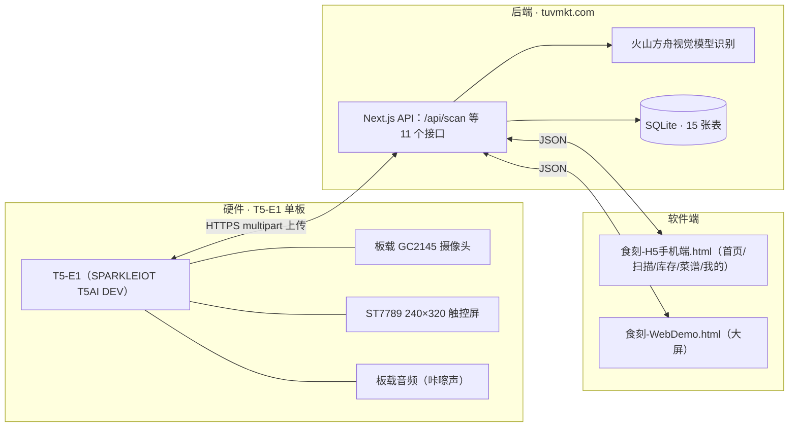

# 「食刻」产品文档（已实现版 · v3）

> Slogan：**食刻在场，不浪费每一份食材**
> 项目：食刻（Shike）· AI 冰箱食品管理
> 状态（2026-08-16）：**主链路已全部实现并上线**——硬件已烧录、后端已部署 tuvmkt.com、软件端 H5 可用。

---

## 1. 产品逻辑（当前真实可演示）

食刻是一台放在冰箱 / 零食柜旁的智能扫描台：**把食品拿到镜头前扫一下，云端 AI 认出它是什么、能放多久，库存自动记账；屏幕和手机端随时告诉你谁快过期、能做什么菜。**

核心链路：**扫（按按钮拍照）→ 认（云端视觉 AI）→ 记（库存 ±1）→ 显（T5 屏幕 + H5 / 大屏）**

当前真实跑通的三个流程：

1. **放入**：点击【放入】→ 3 秒半透明大数字倒计时 → “咔嚓” → 板载摄像头拍照 → 上传识别 → 屏幕显示品名 / 时间 / 保质期 → 确认后库存 +1；
2. **取出**：点击【取出】→ 同样拍照确认 → 库存 -1；
3. **查看**：H5 / 大屏查看库存（按容器、剩余天数）、临期 / 过期提醒、能做的菜与还缺的食材、购物清单、通知。

识别失败或断网：屏幕提示“没看清，再扫一次”或“网络不好，先不扫描”，本地保留最近一次结果。

### 1.1 软件 App 端产品逻辑（H5 已实现页面）

移动端（食刻-H5手机端.html）底部 5 个 Tab，对应完整 App 产品逻辑：

1. **首页**：冰箱总览（在库种数 / 临期种数）、保鲜提醒（最近到期食材置顶）、今日推荐（按库存匹配菜谱）、购物清单预览、家庭共享（已同步成员数）、快捷入口（扫描食材 / 智能推荐 / 营养分析 / 食材履历 / 快速录入 / 菜谱灵感 / 健康推荐 / 追溯记录）；
2. **扫描**：摄像头取景 → 上传识别 → 结果（品名 / 建议保鲜天数 / 置信度 / 建议容器）→ 确认录入并同步家庭成员；面向老人儿童，对准即扫；
3. **库存**：搜索（名称 / 分类）、品类筛选、按剩余天数排序、KPI（种数 / 临期 / 成员数）、食材卡片（录入人 / 时间 / 到期 / 存放状态 / 标签）、临期横幅；
4. **菜谱**：当前可用食材、今日推荐卡片、更多推荐（换一批）、口味偏好（清淡 / 家常 / 微辣）、我的收藏；
5. **我的**：当前用户（家庭管理员）、绑定成员与容器、在库 / 临期 / 本月省下金额、功能菜单（家庭共享管理 / 购物清单 / 收藏 / 通知设置 / 营养档案 / 帮助反馈 / 关于食刻）。

子页面（弹层）：提醒列表、菜谱详情（有 / 缺食材、步骤、营养、耗时）、购物清单（勾选完成）、成员管理（角色 / 本月录入次数 / 负责品类）、通知中心（未读 + 跳转）、营养档案（蛋白质 / 维C / 膳食纤维 / 钙）、食材履历 / 追溯（来源 / 产地 / 批次 / 冷链 / 检测报告）、快速录入（手动）、口味偏好编辑、通知设置。

---

## 2. 已实现系统（架构）



| 端 | 组件 | 状态 |
|---|---|---|
| 硬件 | T5-E1 单板 + 固件（copy 工程 `app_xzd.c`） | ✅ 已烧录可扫 |
| 后端 | tuvmkt.com（Next.js + Prisma + SQLite，Docker 部署） | ✅ 已上线 |
| 视觉识别 | 火山方舟 `doubao-seed-2-1-turbo-260628`（关闭思考，3–5s） | ✅ 已接入 |
| 软件端 | 食刻-H5手机端.html / 食刻-WebDemo.html | ✅ 可用 |

---

## 3. 硬件（已实现）

### 3.1 单板规格（全部板载，无外挂）

| 部件 | 规格 |
|---|---|
| 主控 + 屏 | T5-E1（SPARKLEIOT T5AI DEV）：ST7789 240×320 触控彩屏（CST816X） |
| 摄像头 | 板载 GC2145 DVP（640×480 @15fps 预览） |
| 音频 | 内置 codec + 功放（spk_en GPIO7），“咔嚓”声 |
| 按键 | GPIO8（低有效，取消扫描用） |
| 存储 | microSD（SDIO：CLK=14、CMD=15、D0–D3=16~19） |
| 供电 | USB 5V（固定场景，不用锂电池） |

### 3.2 固件已实现流程（copy 工程）

```text
待机（显示最近临期提醒 + 放入 / 取出按钮）
 → 点击选择 → 实时预览 + 3 秒半透明大数字倒计时
 → 归零自动抓帧（JPEG）→ “咔嚓” → HTTPS 上传 https://tuvmkt.com/api/scan
 → 结果页：品名 / 时间 / 保质期 / 建议容器 → 确认（库存 ±1）或重拍
失败 → 提示重扫；断网 → 显示本地最近记录
```

- 配置：`app_xzd_cfg.h`（服务器 tuvmkt.com、路径 /api/scan、设备 ID `xzd-t5e1-001`、默认容器「冰箱」、上传超时 15s）；
- 烧录：`tos.py build` → `tyutool_cli write -d t5 -f copy_QIO_1.0.0.bin -p <port> -b 460800`（详见硬件烧录需求文档）。

---

## 4. 后端（已上线 tuvmkt.com）

### 4.1 接口（11 个，全部公开，原型阶段）

| 接口 | 用途 |
|---|---|
| `POST /api/scan` | 硬件 / H5 上传照片 → 识别 → 库存 ±1 → 识别库沉淀 → 返回扁平 JSON（code/name/scannedAt/expiryDate/daysLeft/suggestedContainer/confidence/keepDays/stockTotal） |
| `GET /api/items` | 库存（按容器筛选、剩余天数排序、成员 / emoji / 状态） |
| `GET /api/reminders` | 临期（≤3 天）与过期列表（未知保质期不误报） |
| `PATCH /api/items/[id]` | 手动修改容器分类 |
| `GET /api/members` | 家庭成员（角色 / 头像 / 负责品类 / 本月录入次数） |
| `GET /api/shopping-list` + `PATCH [id]` | 购物清单（单位 / 完成勾选） |
| `GET /api/notifications` + `PATCH [id]` | 通知中心（未读 / 跳转） |
| `GET /api/recipes` | 菜谱（自动算「有 / 缺」食材） |
| `POST /api/consume` | 消耗 / 过期 / 浪费记录（统计输入） |
| `GET /api/catalog` | 识别知识库（品类 / emoji / 保鲜天数 / 营养） |
| `POST /api/device/heartbeat`、`GET /api/device/state` | 设备在线与待机屏数据（后端已就绪，固件心跳待接） |

### 4.2 数据库（SQLite · 15 张表）

库存与流水：`FoodItem`、`ScanLog`；
软件端：`Member`、`Container`、`FoodCatalog`、`ShoppingListItem`、`Notification`、`ConsumptionLog`、`Recipe`、`WeeklyMealPlan`、`RecipePreference`、`FoodTrace`；
硬件端：`Device`、`DeviceLog`、`TemperatureLog`、`ReminderRecord`、`ReminderSetting`。

（字段与模型详见 [后端对接说明.md](./后端对接说明.md)）

### 4.3 视觉识别

- 模型：火山方舟 `doubao-seed-2-1-turbo-260628`（`thinking disabled` + 短提示，实时识别）；
- 低置信（<0.5）不入库，固件走“再扫一次”；
- 识别结果自动写入 `FoodCatalog`，同一商品下次识别保持一致。

---

## 5. 软件端（App / H5 产品逻辑 · 已实现页面与数据状态）

| Tab | 功能逻辑 | 数据状态 |
|---|---|---|
| 首页 | 冰箱总览 KPI、保鲜提醒、今日推荐、购物清单预览、家庭共享、快捷入口 | 演示数据（items/reminders 接口已就绪） |
| 扫描 | 取景 → `POST /api/scan` → 品名 / 保鲜天数 / 置信度 / 建议容器 → 确认录入 | ✅ 真实接口 |
| 库存 | 搜索、品类筛选、排序、食材卡片、临期横幅 | 演示数据（`GET /api/items` 已就绪） |
| 菜谱 | 当前可用食材、今日推荐、更多推荐、口味偏好、收藏 | 演示数据（`GET /api/recipes` 已就绪） |
| 我的 | 成员管理、购物清单、收藏、通知设置、营养档案、食材履历 | 演示数据（members/shopping/notifications 接口已就绪） |

**子页面**：提醒列表、菜谱详情（有 / 缺）、购物清单勾选、成员管理、通知中心、营养档案、食材履历 / 追溯、快速录入、口味偏好、通知设置——页面均已实现，数据为演示数据，对应后端表已建（见 §4.2），接口待逐个接通。

- **食刻-H5手机端.html**：移动端主界面（iPhone 16 适配，底部 5 Tab + 弹层子页面）；
- **食刻-WebDemo.html**：大屏版（已接 `GET /api/items`，服务器数据优先、断网回退演示数据）。

---

## 6. 未实现（已从主流程删除 · 待办）

| 类别 | 未做项 |
|---|---|
| 硬件 | DS18B20 温度上报（表已建，固件未接）、DHT11 湿度、RFP602 称重、WS2812B 灯带、门磁、语音播报（DFR0760）、离线识别（HuskyLens）、条码扫码（已决定不做） |
| 推送 | 场景化推送（下班前弹窗）、每日 08:00 汇总、温度异常提醒（`ReminderRecord/Setting` 表已建，定时任务未做） |
| 菜谱 | 周度菜谱计划（`WeeklyMealPlan` 表已建，接口 / 种子未做）；口味偏好与收藏：**H5 页面已实现（演示数据），`RecipePreference` 接口待接** |
| 软件 | 营养档案、食材履历 / 追溯：**H5 页面已实现（演示数据），接口待接**（`FoodTrace` 表已建）；原生 App / 涂鸦小程序、家人远程推送未做 |
| 固件 | 设备心跳（后端接口已就绪，固件未调用） |

---

## 7. Demo 叙事（按真实流程）

1. 设备静置，T5 屏幕显示最近一次临期提醒；
2. 点【放入】→ 3 秒倒计时 → 把牛奶拿到镜头前 → “咔嚓” → 屏幕显示「光明鲜牛奶 · 时间 · 保质期」→ 确认；
3. H5 / 大屏演示：库存出现牛奶、菜谱里「西兰花炒蛋」自动算好哪些有 / 哪些缺；
4. 彩蛋：过期贴纸再扫一次 → 低置信提示 / 过期状态展示；
5. 收尾：**“食刻在场，不浪费每一份食材。”**

> 演示保底：预录照片可离线跑“识别 → 提醒”链路。

---

## 8. 评审维度

- **人本价值**：减少食物浪费、守护家庭饮食安全；
- **技术实现**：T5-E1 单板拍照 + 云端视觉识别 + 端云库存闭环 + H5 联动，全链路真实运行；
- **创新价值**：把“拍照识物”落到家庭库存管理高频场景；
- **产品体验**：点一下 → 扫一下 → 咔嚓 → 看到结果，老人小孩都能用；
- **产品化潜力**：单板 + USB 供电，物料成本低，可量产；
- **表达与故事**：食刻在场，不浪费每一份食材。
