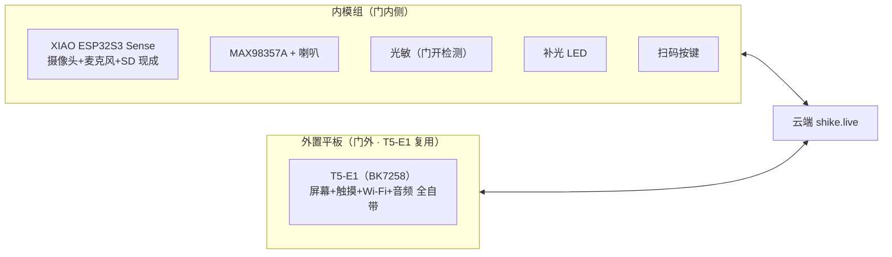

# 食刻 · V1 样机零基础构建指南（双模组拼接版）

> 版本：v3.1 ｜ 创建：2026-08-20 ｜ 更新：2026-08-21（外置平板改用 T5-E1 复用，零采购；软件环境分双平台）
> 目标：手动拼接出双模组样机，验证全功能链路（扫码 → 识别 → 播报 → 事件 → 同步 → 汇总）。
> 原则：不焊接、不接复杂总线；采购清单见 [食刻-BOM-采购清单.md](./食刻-BOM-采购清单.md)。

---

## 0. 定心丸

1. **不焊接**：全部用杜邦线 / 现成排线 / Type-C；
2. **摄像头零接线**：内模组用 XIAO ESP32S3 Sense，摄像头自带；
3. **每一步都有验收**：看到预期结果再继续，看不到查排障表（§7）。

---

## 1. 系统拓扑



---

## 2. 内模组组装（XIAO ESP32S3 Sense + 外设）

### 2.1 认识板子

```
┌────────────────────────────┐
│  [摄像头]                   │
│  XIAO ESP32S3 Sense        │
│  USB-C（烧录 / 供电）        │
│  （出厂无排针）              │
└────────────────────────────┘
```

**重要**：XIAO 出厂**不带排针**，把 Sense 插到 **XIAO 扩展板**（BOM A2）上，用扩展板引出的排针 / Grove 口接线。

### 2.2 外设接线表

| 外设 | 引脚（XIAO 侧） | 说明 |
|---|---|---|
| MAX98357A VIN / GND | 扩展板 5V / GND | 功放供电（5V 功率足） |
| MAX98357A BCLK / LRC / DIN | GPIO5 / 6 / 7（**以官方 I2S 示例为准**） | I2S 音频 |
| 喇叭 | 功放 SPK+ / SPK− | 两根线 |
| 光敏模块 DO / VCC / GND | GPIO1 / 3V3 / GND | 门开检测（开门灯亮 → 高电平） |
| 补光 LED 模块 SIG | GPIO3 | 事件触发亮（**GPIO21 是板载用户灯，勿外接**） |
| 轻触按键一端 | GPIO2，另一端 GND | 扫码触发（按下为低） |

> ⚠️ **摄像头引脚以 Seeed 官方 Wiki / esp32-camera 的 `CAMERA_MODEL_XIAO_ESP32S3` 为准**：XCLK=10、PCLK=13、VSYNC=38、HREF=47、SIOD=40、SIOC=39、D0–D7=15/17/18/16/14/12/11/48。**仓库内示例代码已按此修复**（统一见 `样机代码/内模组-00-共享配置/config.h`）——旧的手写引脚表是 ESP32-S3-EYE 风格，且 VSYNC/HREF(6/7) 与 I2S 音频冲突，不要再改回去。接线后先不插电，装好软件再上电。

---

## 3. 外置平板组装（复用 T5-E1 · 零接线）

T5-E1（SPARKLEIOT T5AI DEV）自带屏幕、触摸、Wi-Fi、音频，**无需接线**：

- 供电：USB 5V（样机阶段固定供电即可）；
- 交互：触摸屏（CST816X）自带，唤醒 / 确认直接用触摸或板载按键 GPIO8；
- 上云：HTTPS 客户端已验证（现有固件即上传 shike.live），直接复用；
- PIR / 光敏：样机阶段不需要（触摸即唤醒）；成品版才做低功耗唤醒。

> 若手头没有 T5-E1，才按 BOM §3 方案 B1 / B2 采购合宙 + 屏幕或 BOX-3。

---

## 4. 软件环境（双平台）

### 4.1 内模组（XIAO ESP32S3 Sense · Arduino IDE）

1. 下载安装 **Arduino IDE 2.x**；
2. 文件 → 首选项 → 附加开发板管理器网址，填：`https://raw.githubusercontent.com/espressif/arduino-esp32/gh-pages/package_esp32_index.json`；
3. 开发板管理器安装 **esp32** 支持包（≥2.0.8），板卡选择 **Seeed XIAO ESP32S3**；
4. 库管理器安装：**esp32-camera**（拍照；XIAO 型号已内置 `CAMERA_MODEL_XIAO_ESP32S3` 配置）、**WIFI / HTTPClient**（自带）。

### 4.2 外置平板（T5-E1 · TuyaOpen IDE）

1. 使用项目现有环境：**TuyaOpen IDE**（VSCode / Cursor 扩展）+ TuyaOpenSDK（`/Users/lwl/TuyaOpenIDE/TuyaOpenSDK`）；
2. 开发板配置：`SPARKLEIOT_T5AI_DEV`；
3. 烧录 SOP 与字体约束见 [硬件烧录需求文档](./硬件烧录需求文档-AI硬件平台.md)；
4. 参考现有 `app_xzd.c` 改造：待机页 → 库存列表 → 汇总待确认页。

---

## 5. 里程碑（逐项验收）

### 5.1 内模组

| 里程碑 | 做什么 | 应该看到 | 对应功能 |
|---|---|---|---|
| M1 摄像头出图 | 烧 XIAO 拍照示例 | 串口 / 网页出现画面 | 识别基础 |
| M2 条码解码 | 打印 / 手机显示 EAN-13，对准镜头 | 输出 13 位条码号 | 主动扫码 |
| M3 语音播报 | 烧 I2S 播放示例 | 喇叭出声"叮" | 语音反馈 |
| M4 上云识别 | 拍照 → POST shike.live/api/scan | 返回品名 / 保质期 | 云端链路 |
| M5 完整链路 | 按键 → 拍照 → 识别 → 播报 | 一按一响一结果 | 核心闭环 |
| M6 事件检测 | 手动模拟放入 / 取出经过镜头 | 串口输出放入 / 取出候选 | 事件检测 |
| M7 中途取出 | 同一窗口取出又放回 | 判定"中途取出"，播报提醒 | 中途取出 |

> 顺序建议：M1 → M4 → M5 → M3 → M2 → M6 → M7。先云端后本地，避免卡住。

### 5.2 外置平板

| 里程碑 | 做什么 | 应该看到 | 对应功能 |
|---|---|---|---|
| P1 屏幕点亮 | 烧 LVGL / TFT 示例 | 屏上有内容，能触摸 | 交互基础 |
| P2 云端拉数据 | 连 Wi-Fi，拉 shike.live 库存 | 显示库存列表 | 展示 |
| P3 汇总待确认 | 手动构造一次汇总 | 平板显示"待确认" | 汇总三通道（部分） |

### 5.3 双模组联调

| 里程碑 | 做什么 | 应该看到 | 对应功能 |
|---|---|---|---|
| D1 数据同步 | 内模组扫码 → 云端 → 平板刷新 | 平板出现新条目 | 双模组通信 |
| D2 汇总闭环 | 内模组关门结算 → 平板待确认 → App 红点 | 三处可见 | 三通道 |
| D3 离线兜底 | 断网扫码 → 本地队列 → 恢复后上传 | 0 丢失 | 本地队列 |

---

## 6. 排障速查表

| 现象 | 可能原因 | 处理 |
|---|---|---|
| 上传失败 / 找不到端口 | 线是充电线 / 驱动缺失 | 换数据线；装驱动；查板卡进入烧录模式方法 |
| 摄像头黑屏 / 白屏 | 引脚配置不对 / 供电不足 | 用官方示例默认引脚；USB 直连电脑，不经 HUB |
| 屏幕不亮 / 花屏 | 接线错 / 引脚配置与板卡不符 | 核对 §3.1；TFT_eSPI 里按实际板卡配置 User_Setup |
| 连不上 Wi-Fi | 密码 / 频段 | 只连 2.4G；核对 SSID |
| 听不到声音 | 接线反 / 功放未使能 | 核对 §2.2；GAIN 悬空或接 3V3 |
| 光敏不触发 | 方向 / 电压 | 开门对着冰箱灯方向；DO 输出电平与代码预期核对 |
| 识别超时 | 图片太大 / 网络慢 | VGA + JPEG 压缩；确认 shike.live 可达 |

---

## 7. 学习资料

1. Seeed XIAO ESP32S3 官方 Wiki（摄像头示例 / 接线 / FAQ）；
2. 合宙 ESP32S3-Zero 资料页（引脚图 / 屏幕示例）；
3. Arduino 官方入门（Blink 开始）；
4. esp32-camera GitHub（拍照 / 条码相关代码）；
5. LVGL 官方示例（docs.lvgl.io）。

---

## 8. 下一步

1. 按 [BOM 采购清单](./食刻-BOM-采购清单.md) 下单（第一批：A 内模组 + 基础工具）；
2. 等货期间装好 Arduino IDE + 板支持（§4）；
3. 货到：内模组接线（§2）→ 按 §5 里程碑逐个验收；
4. 验收过程按 [手动测试方案](./食刻-手动测试方案.md) 记录。
